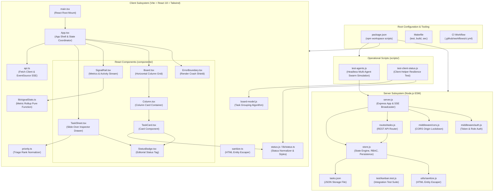
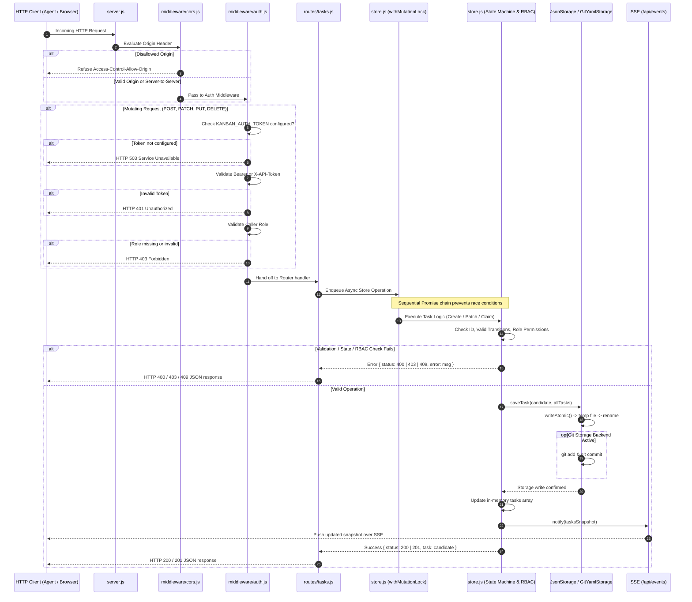
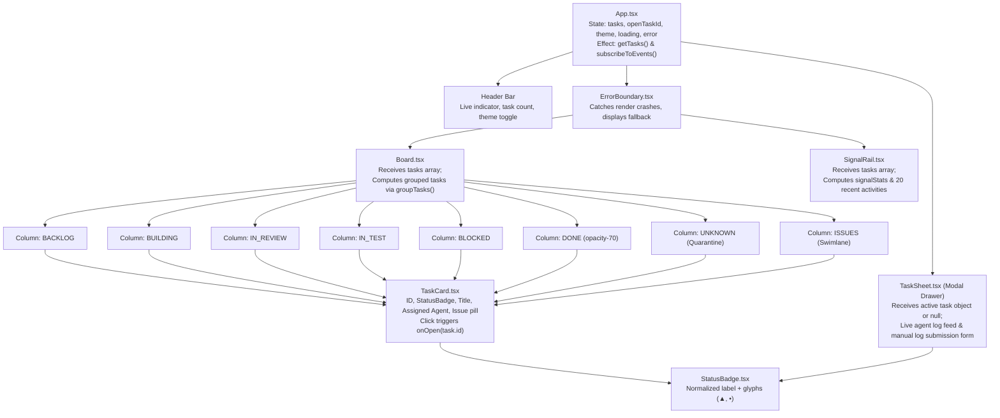

# Agent Kanban Board — File-by-File Technical Reference

This document provides a comprehensive, exhaustive walkthrough of every source, configuration, script, and documentation file across the entire `agent-kanban-board` repository.

---

## 1. Codebase Dependency & Architecture Topology

---

## 2. Server Request Pipeline & Execution Flow

---

## 3. Client Component Hierarchy & Data Flow

---

## 4. Detailed File-by-File Technical Directory

### 4.1 Root Manifests & Orchestration

#### `package.json`
- **Path:** [`package.json`](../package.json)
- **Type:** Root npm configuration (`"type": "module"`).
- **Scripts:**
  - `npm test`: Runs server tests, client status tests, client unit tests, and compiles the client bundle.
  - `npm start`: Runs the backend API on port 4000.
  - `npm run build`: Produces production client bundle in `client/dist`.

#### `Makefile`
- **Path:** [`Makefile`](../Makefile)
- **Targets:**
  - `all`: Runs `test` and `build`.
  - `test`: Invokes `npm test`.
  - `build`: Invokes `npm run build`.
  - `start`: Launches backend server via `npm start`.
  - `sec`: Security audit target:
    1. Verifies that no personal absolute user home paths are leaked into tracked repository files.
    2. Enforces that `dangerouslySetInnerHTML` is never used inside `client/src/`.

#### `README.md`
- **Path:** [`README.md`](../README.md)
- **Content:** System description, quickstart guide, state machine transitions, storage engine modes, security/auth model, design system, API table, and headless demo instructions. Links to `ONBOARDING.md`.

#### `ONBOARDING.md`
- **Path:** [`ONBOARDING.md`](../ONBOARDING.md)
- **Content:** "Connect a new project" guide: the project-implicit model (no registration endpoint), the four token mechanisms, project-tagging channels, and a curl walkthrough.

#### `render.yaml`
- **Path:** [`render.yaml`](../render.yaml)
- **Content:** Render.com blueprint — a single Node web service that builds the client and serves both API + SPA, with a persistent disk mounted at `/data` and auto-generated auth tokens.

#### `railway.json`
- **Path:** [`railway.json`](../railway.json)
- **Content:** Railway config-as-code — Railpack builder, `npm --prefix server start`, and `/api/health` healthcheck.

#### `LICENSE`
- **Path:** [`LICENSE`](../LICENSE)
- **License:** MIT License.

#### `.gitignore`
- **Path:** [`.gitignore`](../.gitignore)
- **Entries:** Ignores `node_modules`, `dist`, build artifacts, and local environments.

---

### 4.2 Backend Server (`server/`)

#### `server/package.json`
- **Path:** [`server/package.json`](../server/package.json)
- **Dependencies:** `express` (^4.19.2), `cors` (^2.8.5), `yaml` (^2.9.0), with `qs` (^6.16.0) security override.
- **Scripts:** `"start": "node server.js"`, `"test": "node --test"`.

#### `server/server.js`
- **Path:** [`server/server.js`](../server/server.js)
- **Functions:**
  - `createApp()`: Instantiates Express, mounts CORS, the `/api/auth` handshake router (before auth), the auth middleware and the rate-limit middleware, mounts `/api/tasks`, `/api/projects`, `/api/metrics` and `/api/health`, handles the `/api/events` Server-Sent Events stream, serves the built client (`client/dist`) with an SPA fallback, and configures the global 500 error handler.
  - `startServer(port, host)`: Asynchronously loads tasks from storage into memory, logs the startup configuration (auth posture, CORS, rate limit), and binds the HTTP server. Host defaults to `0.0.0.0` whenever `PORT` is set (hosted) and `127.0.0.1` otherwise (local dev).
  - CLI Auto-runner: Detects direct execution and launches the server.

#### `server/store.js`

v2.5.0 additions: the per-project settings store (`projectSettings` map,
`COLUMN_COLOR_KEYS`/`COLUMN_COLOR_TOKENS`/`STOCK_COLUMN_COLORS`, `getSettings`
resolution, `updateSettings` under the mutation lock, `onSettings` listeners,
`loadSettings`/`saveSettings` on both storage classes) and the comments field
(defaulted in `backfillLeaseFields`, seeded in `createTask`, round-tripped in
`serializeCard`, written only through `addComment` — deliberately outside
`patchTask`'s allowlist).
- **Path:** [`server/store.js`](../server/store.js)
- **Core Domain State & Engine:**
  - `STATUSES`: Dictionary of loop statuses (`BACKLOG`, `BUILDING`, `IN_REVIEW`, `IN_TEST`, `BLOCKED`, `DONE`).
  - `normalizeStatus(status)`: Normalizes casing and legacy aliases (e.g., `TODO` $\to$ `BACKLOG`).
  - `canTransition(fromStatus, toStatus)`: Verifies if the proposed state jump exists in `VALID_TRANSITIONS`.
  - `canRoleTransition(role, fromStatus, toStatus)`: Enforces role permissions.
  - `writeAtomic(filePath, content)`: Creates unique temp file (`.tmp_<timestamp>_<random>`), writes content, and executes `rename` for atomic POSIX replacement.
  - `withMutationLock(operation)`: Queues mutations on a sequential Promise chain to serialize asynchronous operations.
  - `JsonStorage`: Standalone single-file JSON persistence engine.
  - `GitYamlStorage`: Git-backed YAML storage engine with path traversal protection and automated `git commit`.
  - CRUD Methods: `createTask()`, `patchTask()`, `claimTask()`, `appendLog()`, `addIssue()`.
  - Input hardening (v2.5.8): `createTask(data, project, { caller })` validates shapes and bounds on create — `depends_on` must be an array of non-empty task ids (`validateDependsOn`), `metadata` a plain object of at most 8000 bytes (`validateMetadata`), `title`/`description` capped at 200 / 20000 characters. Creating a task directly in a **work state** (`BUILDING`/`IN_REVIEW`/`IN_TEST`/`DONE`, see `IMPORT_GATED_STATUSES`) requires a privileged credential (`403` otherwise); `BACKLOG` and `BLOCKED` stay open. A body-supplied `assigned_agent` is ignored (ownership is written only by a claim), and `stage_owners`/`agent_logs`/`comments` always start empty so audit provenance cannot be forged at create. The same shape rules apply inside `patchTask`'s allow-list loop.
  - Lease & reaper: `getClaimTtlMs()` (`KANBAN_CLAIM_TTL_MS`, default 600000), `getReapIntervalMs()`, `getOrphanGraceMs()` (`KANBAN_ORPHAN_GRACE_MS`, decoupled from the TTL, default 300000), `applyClaim()`, `renewLease()`, `reapExpiredClaims()`, `reclaimTaskInner()`. An owned task with an expired lease is reaped immediately; an *ownerless active* task must be untouched for the grace window first, anchored on `updated`. Any committed write by the lease holder — `appendLog()`, `renewLease()` and now `patchTask()` — extends `claim_expires_at` to the full TTL (headless workers log and PATCH instead of heartbeating); a non-holder write never extends or steals.
  - Branch normalisation: `toBranch()` normalises the branch value on every write path (non-empty string kept verbatim, anything else `null`), and `backfillLeaseFields()` applies the same normaliser on every READ path — so a legacy dirty `branch` (empty, whitespace-only or non-string) is nulled on load and never re-emerges in API responses or on git-backend cards.

#### `server/routes/tasks.js`
- **Path:** [`server/routes/tasks.js`](../server/routes/tasks.js)
- **Endpoints:**
  - `GET /`: Returns all tasks.
  - `POST /`: Creates a new task card (Status: 201).
  - `GET /archive`: Lists archived tasks (`?project=` scopes).
  - `POST /archive/sweep`: Runs the archive sweep now.
  - `POST /purge`: Bulk-deletes selected or filtered tasks; declared before `/:id`. v2.5.2: the purge scope is clamped to the caller's authorized project (unscoped purges only reach the default project; a disagreeing `filter.project` gets 403) and the delete/purge privilege is derived from the credential (`caller.privileged`), not the asserted `X-Agent-Role`.
  - `POST /next-claim`: Claims the next available task (role from header, `?project=` scopes).
  - `GET /:id`: Retrieves single task or returns 404.
  - `DELETE /:id`: Deletes one task; privileged-role gated via `isPrivilegedRole`.
  - `PATCH /:id`: Updates status or task attributes. A transition into an active stage is now dependency-gated like a claim (409 `dependency_unsatisfied` + `unresolved_dependencies`); DONE/BLOCKED/BACKLOG transitions stay ungated.
  - `POST /:id/claim`: Claims task for an agent ID.
  - `POST /:id/heartbeat`: Renews a task lease.
  - `POST /:id/logs`: Appends structured operational log.
  - `GET /:id/issues`: Lists issue IDs associated with the task.
  - `POST /:id/issues`: Appends an issue ID to the task.

#### `server/routes/projects.js`
- **Path:** [`server/routes/projects.js`](../server/routes/projects.js)
- **Endpoint:** `GET /` — per-project summary (task/live/done/archived counts + `updated`).

#### `server/routes/metrics.js`
- **Path:** [`server/routes/metrics.js`](../server/routes/metrics.js)
- **Endpoint:** `GET /` — cross-project metrics (`?project=` scopes; cycle time, `by_status` histogram, claim contention, active agents).

#### `server/routes/health.js`
- **Path:** [`server/routes/health.js`](../server/routes/health.js)
- **Endpoint:** `GET /` (and `/healthz` alias) — read-only liveness/readiness probe: store state, task counts, listener counts, reaper status, version.

#### `server/routes/auth.js`
- **Path:** [`server/routes/auth.js`](../server/routes/auth.js)
- **Endpoints:** `POST /session` (HMAC session-token handshake, gated by `KANBAN_AUTH_SECRET`) and `POST /stream-ticket` (v2.5.7 — exchanges a bearer credential for a 60 s single-use ticket used by `EventSource` via `?ticket=`).

#### `server/streamTicket.js`
- **Path:** [`server/streamTicket.js`](../server/streamTicket.js)
- **Functions:** `createStreamTicket()`, `verifyStreamTicket()`, `streamTicketTtlMs()`, `liveStreamTicketCount()`, `resetStreamTickets()`.
- **Purpose:** v2.5.7 (ENH-01) short-lived single-use tickets for the SSE endpoint (EventSource cannot set headers). Format `<payload-base64url>.<mac-hex>`; the `jti` is recorded at mint time and deleted on first successful verification, so a replay is inert. Signed with `KANBAN_AUTH_SECRET` when set, else the global `KANBAN_AUTH_TOKEN`.

#### `server/sessionAuth.js`
- **Path:** [`server/sessionAuth.js`](../server/sessionAuth.js)
- **Functions:** `authSecret()`, `createSessionToken()`, `verifySessionToken()` — stateless HMAC-SHA256 session tokens (24h expiry, role+project bound).

#### `server/routes/settings.js`
v2.5.0 per-project display settings. `GET /api/settings` returns the resolved
column colors (stock -> board default -> project override; public read with the
project-scope guard); `PUT /api/settings?project=X` persists a validated
`column_colors` override (any authenticated token, per-project token isolation
inherited from `referencedProjects`).

#### `server/notifier.js`
- **Path:** [`server/notifier.js`](../server/notifier.js)
- **Purpose:** §2.11 outbound Telegram alerts when the lease reaper returns a task to `BACKLOG`.
- **Functions:** `notifierConfig()`, `shouldNotify()`, `formatReclaimMessage()`, `startNotifier()`, `stopNotifier()`, `isNotifierRunning()`.
- **Design:** a pure subscriber on `store.onDiff` (no mutation-path surface). It filters `kind === 'reclaimed'` events by `reason` (`lease_expired` / `orphan_normalized`) and by project, renders a full-detail HTML message (project, task, title, work context, branch, dependencies, issues, truncated description, reason, previous owner, lease expiry, last activity, reclaim count, stage owners, last log, deep link), and POSTs it to the Bot API with the global `fetch` — **no new dependency**. Sends are serialized with a minimum interval and honour `429 retry_after`. Delivery is fail-silent: an outage is logged and never affects the reclaim. Off unless both `KANBAN_TELEGRAM_BOT_TOKEN` and `KANBAN_TELEGRAM_CHAT_ID` are set; the token is redacted from logs.

#### `server/middleware/auth.js`
- **Path:** [`server/middleware/auth.js`](../server/middleware/auth.js)
- **Enforcement:**
  - Permits open read-only access for `GET` requests.
  - Fails closed with 503 if no auth mechanism (`KANBAN_AUTH_TOKEN`, `KANBAN_PROJECT_TOKENS`, or `KANBAN_AUTH_SECRET`) is configured.
  - Tries HMAC session tokens first, then falls back to static tokens: per-project (`KANBAN_PROJECT_TOKENS`), admin (`KANBAN_ADMIN_TOKEN`, audited as `admin_write`), or global (`KANBAN_AUTH_TOKEN`). Returns 401 on mismatch.
  - Validates caller role against `VALID_ROLES`. Missing/unauthorized role returns 403.
  - v2.5.2: derives `req.caller.privileged` from the **credential** for destructive operations — the `KANBAN_ADMIN_TOKEN` bearer or a privileged session role confer it; per-project tokens do not (they are worker credentials); legacy single-token mode leaves the flag unset so the store falls back to the role check.
  - v2.5.7 (ENH-01): `KANBAN_READ_AUTH=token` also gates reads — a GET/SSE must present the bearer token or a single-use stream ticket (`?ticket=`). `/api/health` + `/healthz` stay open. Unset/`off` keeps reads public.
  - Optional redacted auth-failure logging via `KANBAN_AUTH_LOG`.

#### `server/middleware/projectScope.js`
- **Path:** [`server/middleware/projectScope.js`](../server/middleware/projectScope.js)
- **Enforcement:** Extracts every project a request references (body, query, header, composite path) and guards invalid `?project=` as 400 — never a silent widening to the whole portfolio.

#### `server/middleware/rateLimit.js`
- **Path:** [`server/middleware/rateLimit.js`](../server/middleware/rateLimit.js)
- **Enforcement:** Per-project fixed-window rate limiting on mutations, off unless `KANBAN_RATE_LIMIT_PER_MIN` is set.

#### `server/middleware/cors.js`
- **Path:** [`server/middleware/cors.js`](../server/middleware/cors.js)
- **Enforcement:** Enforces an explicit allow-list of origins (`KANBAN_ALLOWED_ORIGIN`, comma-separated, defaults to `http://localhost:5173`). Forbids wildcard `*` and empty entries.

#### `server/utils/sanitize.js`
- **Path:** [`server/utils/sanitize.js`](../server/utils/sanitize.js)
- **Function:** `escapeHtml(str)` escapes HTML characters (`&`, `<`, `>`, `"`, `'`) to prevent Stored XSS.

#### `server/utils/constantTime.js`
- **Path:** [`server/utils/constantTime.js`](../server/utils/constantTime.js)
- **Function:** `tokensMatch(a, b)` — SEC-07 (v2.6.0) shared constant-time-ish comparison used by the auth middleware, session tokens, stream tickets and the session handshake. Unlike the four per-module copies it replaced, it does not early-return on a length mismatch: the length difference is folded into the accumulator and the loop always runs over the longer input, so the comparison time does not leak the secret's length.

#### `server/test/` (Node.js built-in test runner)
- **Paths:** `server/test/kanban.*.test.js`
- **Coverage:** The server suite (354 tests across 33 files) covers duplicate prevention and CRUD (`kanban.test.js`), state transitions + role gating, claim leases and the reaper (`kanban.lease.test.js`), dependency-gated unblocking (`kanban.deps.test.js`), metrics aggregation (`kanban.metrics.test.js`), projects/portfolio summaries (`kanban.projects.test.js`), archive sweep (`kanban.archive.test.js`), SSE diff events (`kanban.events.test.js`), concurrency/mutation-lock behavior (`kanban.concurrency.test.js`), per-project token isolation (`kanban.projectauth.test.js`), cross-project scoping (`kanban.scoping.test.js`), next-claim role binding (`kanban.nextclaim.test.js`), fail-closed auth, HMAC session tokens (`kanban.sessionauth.test.js`), redacted auth logging (`kanban.authlog.test.js`), CORS allow-list (`kanban.cors.test.js`), the health endpoint (`kanban.health.test.js`), periodic backups (`kanban.backup.test.js`), the IPv6/HOST resolution fix (`kanban.host.test.js`), ownerless-active task normalization (`kanban.orphan.test.js`), admin delete + bulk purge incl. the v2.5.2 scope/privilege hardening (`kanban.purge.test.js`), per-stage ownership (`kanban.stageowners.test.js`), the release-version guard (`kanban.version.test.js`), branch-field integrity (`kanban.branch.test.js`), Telegram reclaim notifications (`kanban.notify.test.js`), task comments + column-color settings (`kanban.comments.test.js`, `kanban.settings.test.js`), and corrupt-file fail-closed loading (`kanban.corruptfile.test.js`), the v2.5.5 backup-status block (`kanban.backup.test.js`), the soft-delete trash sink + restore (`kanban.trash.test.js`), read-auth + stream tickets (`kanban.readauth.test.js`), the v2.5.8 createTask input hardening (`kanban.createinput.test.js`), the v2.6.0 security-hardening batch — constant-time token compare, HMAC proof binding, purge-filter guard, SSE stream cap, auth-failure rate limiting, log/comment validation (`kanban.security260.test.js`), and the v2.7.0 server-robustness batch — archive-name collision, dependency-cycle validation, listen-error handling, in-repo storage default, readiness endpoint, Telegram truncation, CORS scheme (`kanban.robustness270.test.js`).

#### `server/tasks.json`
- **Path:** [`server/tasks.json`](../server/tasks.json)
- **Role:** Default-project JSON store (created/updated at runtime); the file also ships sample/seeded tasks.

---

### 4.3 Frontend Client (`client/`)

#### `client/package.json`
- **Path:** [`client/package.json`](../client/package.json)
- **Dependencies:** `react` (^18.3.1), `react-dom` (^18.3.1).
- **DevDependencies:** `vite`, `@vitejs/plugin-react`, `typescript`, `tailwindcss`, `postcss`, `autoprefixer`, `esbuild`.
- **Scripts:** `dev`, `build` (`tsc -b && vite build`), `preview`, `test`.

#### `client/vite.config.ts`
- **Path:** [`client/vite.config.ts`](../client/vite.config.ts)
- **Settings:** Configures the Vite dev server port (`VITE_PORT`, default 5173), the React plugin, and a dev proxy forwarding `/api` to `http://localhost:4000` (changeOrigin) so same-origin `/api` calls reach the backend during local development.

#### `client/tailwind.config.js`
- **Path:** [`client/tailwind.config.js`](../client/tailwind.config.js)
- **Configuration:** Defines semantic color variables (`bg`, `surface`, `line`, `ink`, `muted`, `pass`, `fail`, `warn`, `block`, `live`) and editorial font stacks (`serif`, `mono`, `sans`).

#### `client/postcss.config.js`
- **Path:** [`client/postcss.config.js`](../client/postcss.config.js)
- **Settings:** Tailwind and Autoprefixer plugin registration.

#### `client/tsconfig.json`, `tsconfig.app.json`, `tsconfig.node.json`
- **Paths:** [`client/tsconfig.json`](../client/tsconfig.json), [`client/tsconfig.app.json`](../client/tsconfig.app.json), [`client/tsconfig.node.json`](../client/tsconfig.node.json)
- **Settings:** Strict TypeScript type checking rules for browser and build environments.

#### `client/index.html`
- **Path:** [`client/index.html`](../client/index.html)
- **Content:** Single-page entry HTML, Google font preloading, responsive `<meta name="viewport">`, and an inline pre-paint theme script that applies the stored/OS theme before React mounts (avoids a flash of the wrong theme).

#### `client/src/index.css`
- **Path:** [`client/src/index.css`](../client/src/index.css)
- **Styles:** Light (warm cream) and dark theme CSS variable definitions meeting WCAG AA contrast standards, explicit `color-scheme` per theme (so native form controls match), `@supports (height:100dvh)` shell-height override, `.board-scroll` visible-scrollbar rules, tabular numeric font setup, and minimal global scrollbars.

#### `client/src/main.tsx`
- **Path:** [`client/src/main.tsx`](../client/src/main.tsx)
- **Execution:** Mounts `<App />` into the DOM root under `<React.StrictMode>`.

#### `client/src/App.tsx`
- **Path:** [`client/src/App.tsx`](../client/src/App.tsx)
- **Components & Hooks:** App shell and state coordinator. Manages `tasks`, `openTaskId`, `project` filter, `view` (Board/Portfolio/About), `theme`, `railOpen`, the agent-id/api-token identity, and the board filter/sort state (search, priority, assignee, plus the persisted column sort from `lib/boardSort.ts`). Fetches `getTasks` + subscribes to SSE scoped by project, fetches `/api/health` for the header version chip, and exports the visible tasks to JSON. Renders a wrapping responsive header (with the three-way Board/Portfolio/About segmented switcher), `<Board />`, `<About />`, `<SignalRail />` (docked at `md`+, slide-over drawer below), `<TaskSheet />`, and `<ErrorBoundary />`. The metrics dashboard is fed the unfiltered task list on purpose so its totals stay stable while filters narrow the board.

#### `client/src/types.ts`
- **Path:** [`client/src/types.ts`](../client/src/types.ts)
- **Definitions:** Core data types (`TaskStatus`, `TaskPriority`, `AgentLog`, `Task`).

#### `client/src/api.ts`
- **Path:** [`client/src/api.ts`](../client/src/api.ts)
- **Functions:** HTTP client for REST operations (`getTasks`, `getTask`, `patchTask`, `claimTask`, `appendLog`) and `subscribeToEvents(onTasks)` for native `EventSource` SSE integration.

#### `client/src/status.js` & `status.d.ts`
- **Paths:** [`client/src/status.js`](../client/src/status.js), [`client/src/status.d.ts`](../client/src/status.d.ts)
- **Functions:** `normalizeStatus()` and `statusStyle()` resolving status strings to border stripes and badge color combinations.

#### `client/src/board-model.js` & `board-model.d.ts`
- **Paths:** [`client/src/board-model.js`](../client/src/board-model.js), [`client/src/board-model.d.ts`](../client/src/board-model.d.ts)
- **Function:** `groupTasks(tasks)` categorizing tasks into column arrays by status (`BACKLOG`, `BUILDING`, `IN_REVIEW`, `IN_TEST`, `BLOCKED`, `DONE`, `UNKNOWN`) and aggregating issues into a dedicated `ISSUES` array.

#### `client/src/priority.ts`
- **Path:** [`client/src/priority.ts`](../client/src/priority.ts)
- **Function:** `normalizePriority()` safely mapping triage ratings (`P0-critical`, etc.) to `'high' | 'medium' | 'low'`; `priorityBadgeClass()` and `PRIORITY_WEIGHT` drive the priority badge chips and the default sort order.

#### `client/src/sanitize.ts`
- **Path:** [`client/src/sanitize.ts`](../client/src/sanitize.ts)
- **Function:** Client-side HTML entity handling. `escapeHtml` mirrors the server's escaping (the definition of the entity set); `decodeStored` inverts it for display — the server escapes untrusted text on write, so the client decodes the known entity set at render time (`TaskSheet` title/description/log message, `TaskCard` title, `SignalRail` message). Decode order matters: specific entities first, `&amp;` last, so a stored `&amp;lt;` never becomes a real tag. Decoded values are still rendered as JSX text nodes — never HTML. Guarded by `client/src/lib/sanitize.test.mjs`.

#### Components (`client/src/components/`)
- **`Board.tsx`:** Renders the horizontally snap-scrolling column container for all 8 columns including `UNKNOWN`, with edge-fade gradients and paging chevrons that appear when columns are off-screen. `COLUMNS` carries the workflow step numbers (`01`–`04`) down to each `Column` (the v2.4.0 advisory WIP limits were removed in v2.5.2).
- **`BoardFilters.tsx`:** Filter/sort/export toolbar rendered above the board: live substring search, priority and assignee quick filters, the persisted column sort selector (`Priority | Recently Updated | Task ID`), a `Reset` action when any filter is active, one-click JSON export, and the metrics-dashboard toggle. Shows an `n of m tasks` counter.
- **`ColumnColorsControl.tsx`:** v2.5.0 popover (mirrors HeaderHelp: outside-click + Escape) with one swatch row per swimlane and Reset-to-defaults; picks are saved optimistically via `PUT /api/settings` and applied live over SSE.
- **`MetricsDashboard.tsx`:** Toggleable summary banner with 7 tiles (Total, Backlog, In Flight, Blocked, Completed, Avg Cycle Time, Overdue/Stalled) computed from the unfiltered task list by `lib/dashboardMetrics.ts`.
- **`Column.tsx`:** Renders a column header with workflow step number, a plain task count badge (the advisory WIP badges/banner were removed in v2.5.2) and vertically scrolling card container. Each column carries a distinct top accent per stage (violet for In Test). Responsive: `85vw` with snap alignment below `md`, fixed `w-72` from `md` up. Memoized.
- **`TaskCard.tsx`:** Renders card ID, status stripe, priority badge, effort/estimate chip (`⚡` from task metadata), title (double-click to inline-edit with optimistic CAS), project chip (unscoped board only), agent assignment, and issues badge. High-priority cards get a red right accent. Memoized.
- **`StatusBadge.tsx`:** Renders status glyphs (`▲`, `•`) and styling.
- **`TaskSheet.tsx`:** Slide-over modal displaying card details (including the project), metadata, logs timeline, and human log submission form.
- **`SignalRail.tsx`:** Right sidebar rendering Signal Overview metric tiles and recent activity feed. Docked at `md`+, rendered as a mobile slide-over drawer below `md`.
- **`Portfolio.tsx`:** Cross-project aggregate view with per-project summary rows.
- **`About.tsx`:** In-app product overview (third top-level view). Renders the elevator pitch, a headless-first curl snippet, a trust strip, the "why a normal board isn't enough" cards, the lifecycle walk, capabilities, an **Architecture & code flow** section (the stack table, the step-by-step next-claim code path, the three safety layers around every write, and a six-layer summary — all data-driven and mobile-first, with the stack table collapsing to labelled cards below `sm`), a curated tour of `/landing/*.png` screenshots, an FAQ, and the community CTA. Takes the live server `version` as a prop so the page can never show a stale version.
- **`HeaderHelp.tsx`:** Header `i` button opening a popover that explains the agent-id (auto-claim) and api-token header fields.
- **`ErrorBoundary.tsx`:** React Class Error Boundary containing card render errors.

#### Client Libraries (`client/src/lib/`)
- **`theme.ts`:** Pure theme resolution helpers (`resolveTheme`, `nextTheme`, `isDark`, `THEME_STORAGE_KEY`).
- **`status.ts`:** `CANONICAL_STATUSES` and `ACTIVE_STATUSES` matching backend definitions.
- **`filterTasks.ts`:** Pure filter predicate — live substring search (id/title/description/branch/assigned_agent), normalized-priority filter, and assignee filter including `unassigned`. Guarded by `filterTasks.test.mjs`.
- **`boardSort.ts`:** Column ordering for the board — `sortTasks(tasks, sort)` over `priority | updated | id` (stable, non-mutating; priority reuses `PRIORITY_WEIGHT`), plus `readStoredSort`/`writeStoredSort` persisting the choice under `localStorage kanban.sort` so column order survives SSE snapshots and reloads. Guarded by `boardSort.test.mjs`.
- **`columnColors.ts`:** v2.5.0 column-color palette module — token ids, literal `ACCENT_CLASS`/`SWATCH_CLASS` maps (Tailwind JIT requires literal class strings), `DEFAULT_COLUMN_COLORS` (mirrors the server stock palette), `resolveColumnAccent(status, colors)`, and `isStockPalette`. Guarded by `columnColors.test.mjs`.
- **`dashboardMetrics.ts`:** Pure computations behind the metrics dashboard (total/backlog/wip/blocked/done counts, average cycle time, overdue/stalled). Guarded by `dashboardMetrics.test.mjs`.
- **`signalStats.ts`:** `computeSignalStats(tasks)` calculating active/blocked/done counts.
- **`portfolioMetrics.ts`:** Cross-project rollup calculations for the Portfolio view.
- **`claimCoordinator.ts` / `useClaimCoordinator.ts`:** Client-side lease heartbeat + auto-claim coordination bound to the operator's agent identity.
- **`authToken.ts`:** Browser-local storage/wiring of the operator's API token.
- **`aboutContent.ts`:** Pure data for the About view (trust metrics, why-cards, lifecycle steps, capabilities, FAQ, curl snippet, tour-shot list, `RECLAIM_INTRO` / `RECLAIM_FLOW`, and the architecture data — stack rows, claim flow, safety layers, six-layer summary) — no JSX, so it is unit-testable and keeps the copy out of the component.
- **Test files (`*.test.mjs`):** `signalStats`, `boardModel`, `memoComparator`, `portfolioMetrics`, `claimCoordinator`, `theme`, `authToken`, `stageOwners`, `filterTasks`, `dashboardMetrics`, `boardSort`, `sanitize`, `about`, `responsive`, and `mobileToolbar` — run under `node:test` (TypeScript compiled on the fly via `esbuild`). The `memoComparator` and `reactStubForMemoTest` pair use a React stub to exercise the `React.memo` comparators directly; `responsive.test.mjs` is the mobile-layout regression guard, and `mobileToolbar.test.mjs` guards the board toolbar's shrink-and-wrap contract (added in v2.5.9).

---

### 4.4 Scripts & CI Workflows

#### `scripts/test-agents.js`
- **Path:** [`scripts/test-agents.js`](../scripts/test-agents.js)
- **Role:** Headless multi-agent workflow demo script simulating Agent-Alpha and Agent-Beta claiming, transitioning, and logging against cards via REST calls.

#### `scripts/test-client-status.js`
- **Path:** [`scripts/test-client-status.js`](../scripts/test-client-status.js)
- **Role:** Test validating client status normalizer resilience against malformed inputs.

#### `.github/workflows/ci.yml`
- **Path:** [`.github/workflows/ci.yml`](../.github/workflows/ci.yml)
- **Pipeline:** Automated CI running discrete steps — security checks (`make sec`), server tests (`npm --prefix server test`), client status tests, client unit tests (`npm --prefix client test`), and the production build — across Node 20.x and 22.x, using `actions/checkout@v4` and `actions/setup-node@v4`.
