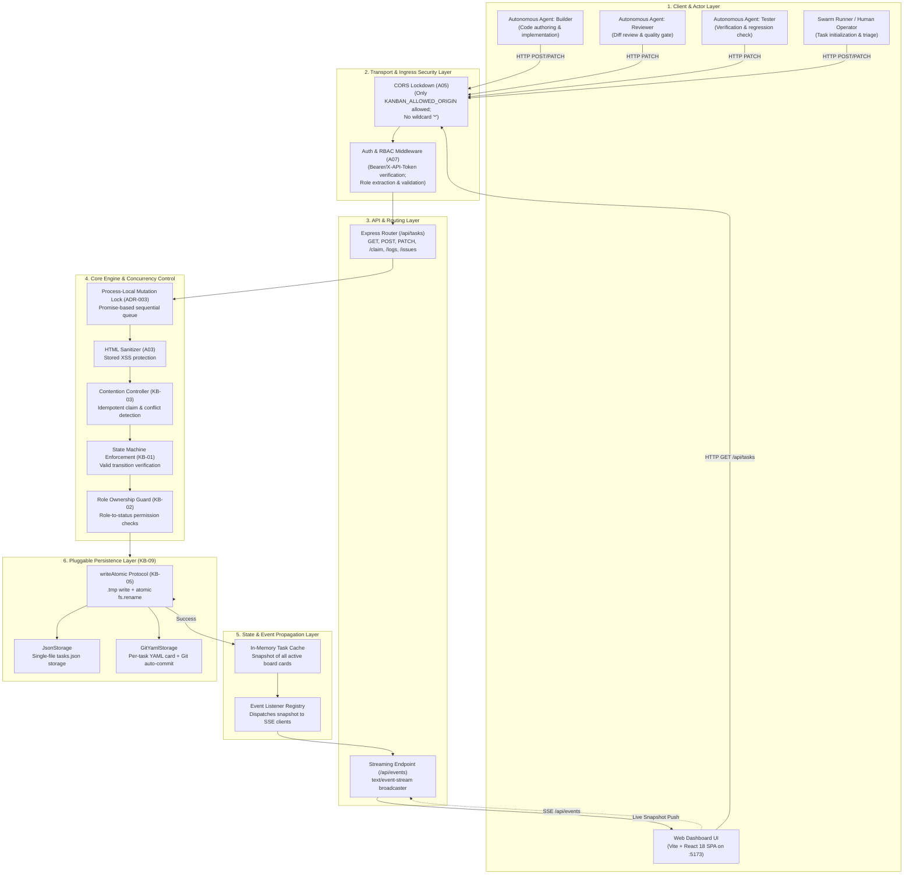
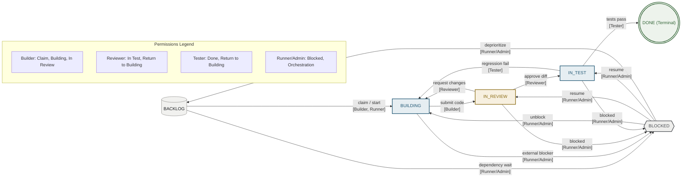
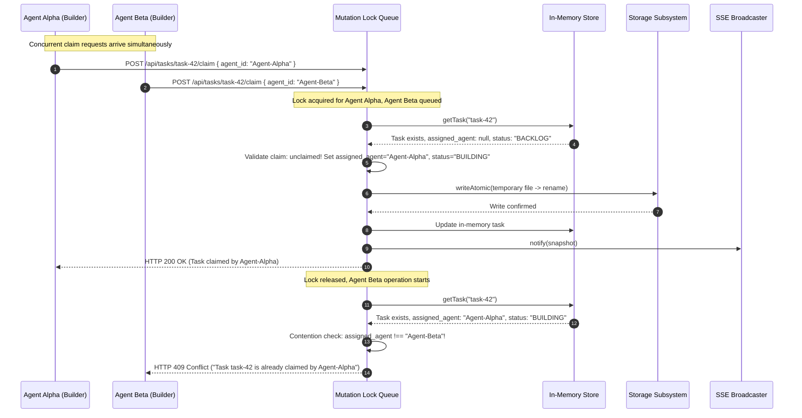
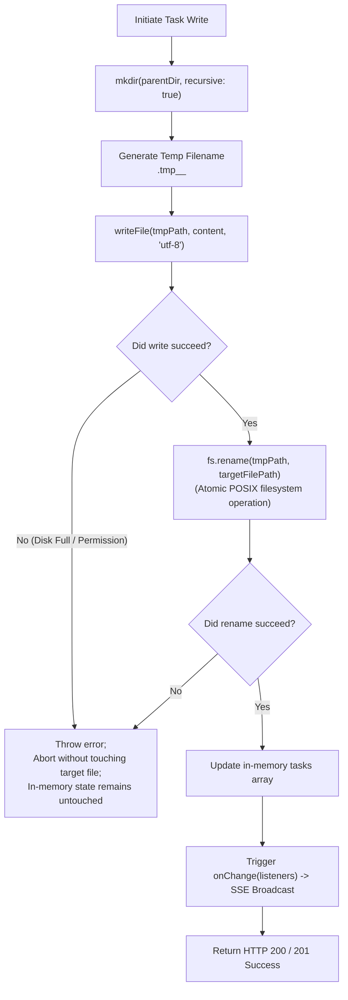
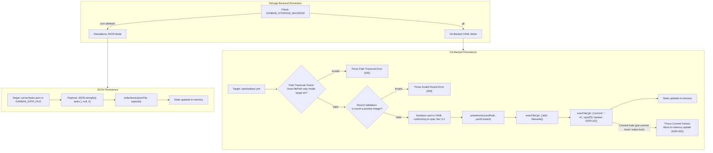
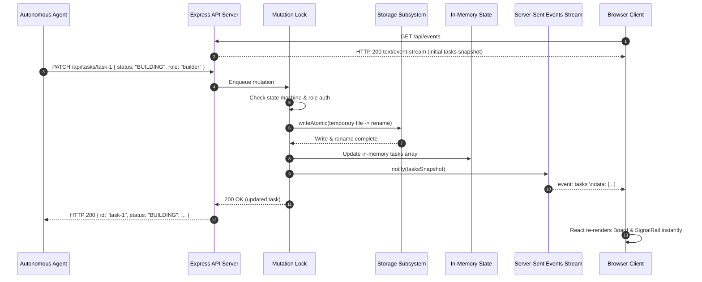

# Agent Kanban Board — System Design & Architecture Specification

**System Version:** 2.1.0  
**Target Environment:** Local-first Autonomous AI Agent Swarms & Human Ops Oversight  
**Repository:** `agent-kanban-board`

---

## 1. Executive Summary & Design Philosophy

The **Agent Kanban Board** is a specialized, local-first state dashboard and orchestration register engineered specifically for swarms of autonomous AI coding agents (such as Claude Code, Codex, Antigravity, or custom loop runners).

### Key Architectural Tenets

1. **Agent-Driven, Headless-First Operation:**
   Traditional Kanban tools (Jira, Trello, Linear) are human-centric, featuring drag-and-drop interactions, complex auth flows, and heavy relational dependencies. In contrast, this board is built for programmatic interaction via lightweight REST HTTP calls.
2. **Intentional Omission of Drag-and-Drop:**
   Drag-and-drop interactions are deliberately excluded from the user interface. In an autonomous swarm loop, cards represent executing git worktrees, active processes, and test runs. Accidental human clicks or drag events could corrupt state machines and cause split-brain executions.
3. **Local-First & Telemetry-Zero:**
   The entire system runs locally on `localhost` (API default: port 4000; UI default: port 5173). There are no cloud dependencies, external databases, SaaS subscriptions, or telemetry calls.
4. **Real-Time Human Observability via Server-Sent Events (SSE):**
   Human operators monitor autonomous swarms live. Any agent mutation (task creation, claim, transition, log entry) updates in-memory state and immediately broadcasts to all connected browser clients via an SSE stream with zero manual page refreshes.
5. **Strict State Machine & Role-Based Access Control (RBAC):**
   Transitions follow an immutable loop lifecycle (`BACKLOG → BUILDING → IN_REVIEW → IN_TEST → DONE`). Roles (`builder`, `reviewer`, `tester`, `runner`) are strictly bound to allowable transitions.
6. **Dual Persistence Strategy (Pluggable Storage):**
   Supports standalone atomic single-file JSON persistence for isolated workstations, or Git-backed YAML cards (`ops/kanban/<id>.yml`) where every state transition creates an atomic Git commit (`ops(<id>): kanban <STATUS>`).

---

## 2. Technology Stack

### 2.1 Backend Server

| Layer / Concern | Technology | Version | Purpose / Rationale |
|---|---|---|---|
| **Runtime** | Node.js (ESM) | 20.x, 22.x | Native ES Modules (`"type": "module"`), native `node:test` runner, native `fetch`, native `fs/promises`. |
| **HTTP Framework** | Express | ^4.19.2 | Minimalist HTTP routing, middleware pipeline, and streaming response handler for SSE. |
| **Persistence (YAML)** | `yaml` | ^2.9.0 | High-performance YAML parsing and stringification for Git-backed cards. |
| **Cross-Origin Control** | `cors` | ^2.8.5 | Restricts browser access strictly to the configured frontend origin. |
| **Version Control Integration** | `child_process.execFile` (promisified) | Native | Direct execution of `git add` and `git commit` without external Git wrapper overhead. |
| **Test Suite** | `node:test` + `node:assert/strict` | Native | Zero-dependency, native Node test runner with suite lifecycle hooks (`before`, `after`, `describe`, `it`). |

### 2.2 Frontend Client

| Layer / Concern | Technology | Version | Purpose / Rationale |
|---|---|---|---|
| **Core UI Framework** | React | ^18.3.1 | Functional components, hooks (`useState`, `useEffect`, `useMemo`, `useCallback`, `useLayoutEffect`, `useRef`), `React.memo` render gating on `Column`/`TaskCard`, React.StrictMode. |
| **DOM Renderer** | React DOM | ^18.3.1 | Client-side root mounting (`createRoot`). |
| **Build & Dev Server** | Vite | ^5.3.3 | Lightning-fast HMR, ES module bundling, asset optimization, `/api` dev proxy to the backend. |
| **Language** | TypeScript | ^5.5.3 | Strict type definitions (`types.ts`, `status.ts`, component props). |
| **Styling Engine** | Tailwind CSS + PostCSS | ^3.4.4 / ^8.4.39 | Utility-first styling adhering to the editorial minimalist design system; `darkMode: 'class'`. |
| **Theming** | CSS custom properties + `color-scheme` | Browser Native | Warm-cream light / warm-charcoal dark palettes; explicit choice beats OS preference; persisted in `localStorage`; native controls follow the active scheme. |
| **Responsive Layout** | Tailwind breakpoints + `100dvh` | Browser Native | Wrapping app shell, `85vw` snap-scroll columns below `md` (`w-72` from `md` up), Signal Rail collapses into a slide-over drawer below `md`. |
| **Real-Time Transport** | W3C `EventSource` (SSE) | Browser Native | Automatic reconnects, low overhead streaming, unidirectional server-to-client push. |
| **Bundling for Tests** | `esbuild` | ^0.25.0 | On-the-fly TS bundling in `.mjs` test runner across Node 20.x & 22.x. |

### 2.3 Typography & Design System

- **Display Serif:** `Instrument Serif` (editorial headers, title badges).
- **Technical Monospace:** `JetBrains Mono` / System Monospace (`ui-monospace`, `SF Mono`, `Menlo`, `Consolas`) with `tabular-nums` for card IDs, counts, timestamps, and metric rollups.
- **Body Sans-Serif:** System UI stack (`system-ui`, `-apple-system`, `Segoe UI`, `Helvetica`, `Arial`).
- **Surface & Hairlines:** 1px borders (`border-line`), 0px radius on cards, 3px vertical severity stripe on cards; dropshadows and heavy gradients are banished.
- **Theme Support:** Dynamic CSS custom properties with an explicit Light/Dark toggle; the operator's stored choice wins over the OS `prefers-color-scheme`, and `color-scheme` keeps native form controls in sync.
- **Responsive Behaviour:** The app shell wraps rather than overflowing horizontally; board columns snap-scroll at `85vw` on mobile; the Signal Rail is a docked sidebar at `md`+ and a slide-over drawer below `md`.

---

## 3. Layered System Architecture



---

## 4. State Machine & Access Control Engine

### 4.1 State Machine Transition Graph with RBAC

The loop lifecycle is strictly deterministic (ADR-001). Arbitrary state transitions are rejected with `409 Conflict`. Role violations are rejected with `403 Forbidden`.



#### Transition Table

| Origin State | Destination State | Allowed Roles | HTTP Status on Illegal Transition | HTTP Status on Role Violation |
|---|---|---|---|---|
| `BACKLOG` | `BUILDING` | `builder`, `runner`, `system`, `human`, `admin` | `409 Conflict` | `403 Forbidden` |
| `BACKLOG` | `BLOCKED` | `runner`, `system`, `human`, `admin` | `409 Conflict` | `403 Forbidden` |
| `BUILDING` | `IN_REVIEW` | `builder`, `runner`, `system`, `human`, `admin` | `409 Conflict` | `403 Forbidden` |
| `BUILDING` | `BLOCKED` | `runner`, `system`, `human`, `admin` | `409 Conflict` | `403 Forbidden` |
| `IN_REVIEW` | `IN_TEST` | `reviewer`, `runner`, `system`, `human`, `admin` | `409 Conflict` | `403 Forbidden` |
| `IN_REVIEW` | `BUILDING` | `reviewer`, `runner`, `system`, `human`, `admin` | `409 Conflict` | `403 Forbidden` |
| `IN_REVIEW` | `BLOCKED` | `runner`, `system`, `human`, `admin` | `409 Conflict` | `403 Forbidden` |
| `IN_TEST` | `DONE` | `tester`, `runner`, `system`, `human`, `admin` | `409 Conflict` | `403 Forbidden` |
| `IN_TEST` | `BUILDING` | `tester`, `runner`, `system`, `human`, `admin` | `409 Conflict` | `403 Forbidden` |
| `IN_TEST` | `BLOCKED` | `runner`, `system`, `human`, `admin` | `409 Conflict` | `403 Forbidden` |
| `BLOCKED` | `BUILDING`, `IN_REVIEW`, `IN_TEST`, `BACKLOG` | `runner`, `system`, `human`, `admin` | `409 Conflict` | `403 Forbidden` |
| `DONE` | *(Any)* | **None (Terminal state)** | `409 Conflict` | `409 Conflict` |

---

## 5. Concurrency & Contention Engineering

### 5.1 Claim Contention Sequence Diagram

In a multi-agent swarm, multiple agents may race to claim the same backlog item simultaneously. The diagram below illustrates how the process-local lock and claim validator handle contention deterministically:



### 5.2 Process-Local Mutation Serialization (ADR-003)

Because Node.js executes asynchronous I/O across event loop turns, two simultaneous HTTP requests could read the same memory state, both pass the claim check, and write out to disk concurrently.

To prevent race conditions, all mutating operations (`createTask`, `patchTask`, `claimTask`, `appendLog`, `addIssue`) are queued through a process-local promise chain:

```javascript
let mutationQueue = Promise.resolve();

function withMutationLock(operation) {
  const run = mutationQueue.then(operation, operation);
  mutationQueue = run.catch(() => undefined);
  return run;
}
```

---

## 6. Persistence Subsystem & Atomic Protocols

### 6.1 Atomic File Protocol (`writeAtomic`)

To guarantee zero corruption on unexpected process terminations (power loss, `SIGKILL`), files are never overwritten in-place. The following flowchart explains the atomic update sequence:



### 6.2 Pluggable Storage Backends: Git vs JSON



---

## 7. Security & Hardening Architecture

| Threat / Vulnerability | OWASP Category | Defense Implemented in Code |
|---|---|---|
| **Unauthenticated Mutation** | A07: Identification and Authentication Failures | All mutating endpoints (`POST`, `PATCH`, `PUT`, `DELETE`) require a token. No mechanism configured (`KANBAN_AUTH_TOKEN`, `KANBAN_PROJECT_TOKENS`, or `KANBAN_AUTH_SECRET`) → fail-closed `503`. Invalid token returns `401`. |
| **Cross-Project Privilege Escalation** | A01: Broken Access Control | `KANBAN_PROJECT_TOKENS` (JSON map `project→token`) isolates writes per project; `referencedProjects` authorizes *every* project a request touches (body/query/header/composite path). `KANBAN_ADMIN_TOKEN` spans all but is audited as `admin_write`. |
| **Long-Lived Secret Exposure** | A07: Identification and Authentication Failures | HMAC session tokens via `POST /api/auth/session` (stateless, 24h, role+project bound) let clients hold a short-lived token instead of a static secret. Raw secret is never transmitted. |
| **Unauthorized State Hijacking** | A01: Broken Access Control | Role ownership matrix enforced in `server/store.js`. Missing role returns `403 Forbidden`. Unauthorized transitions blocked. `next-claim` role is read from the authenticated caller, not the URL. |
| **Stored Cross-Site Scripting (XSS)** | A03: Injection | All agent-authored titles, descriptions, agent IDs, issue IDs, and log messages are sanitized with `escapeHtml` before persistence. Client renders exclusively via React JSX text nodes; `dangerouslySetInnerHTML` is explicitly banned in CI. |
| **Cross-Origin API Abuse** | A05: Security Misconfiguration | `server/middleware/cors.js` forbids wildcard `*`. Restricted to an explicit allow-list (`KANBAN_ALLOWED_ORIGIN`, comma-separated, default `http://localhost:5173`). Untrusted origins receive no `Access-Control-Allow-Origin` header. |
| **Abuse / DoS by Request Flood** | A05 / A10 | Per-project fixed-window rate limiting on mutations (`KANBAN_RATE_LIMIT_PER_MIN`), with `X-RateLimit-*` budget headers on `429`. |
| **Path Traversal Attacks** | A01: Broken Access Control | `isValidTaskId` validates task IDs strictly against `/^[A-Za-z0-9_-]+$/`. `GitYamlStorage` enforces directory prefix checks against resolved filenames. |
| **Information Leakage** | A05: Security Misconfiguration | Global Express error handler catches all unhandled exceptions, logs internally, and returns generic `{ "error": "Internal Server Error" }` without leaking stack traces. |

---

## 8. Real-Time Push & UI Synchronization Flow


