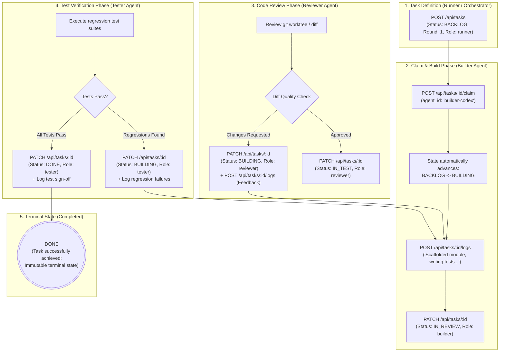
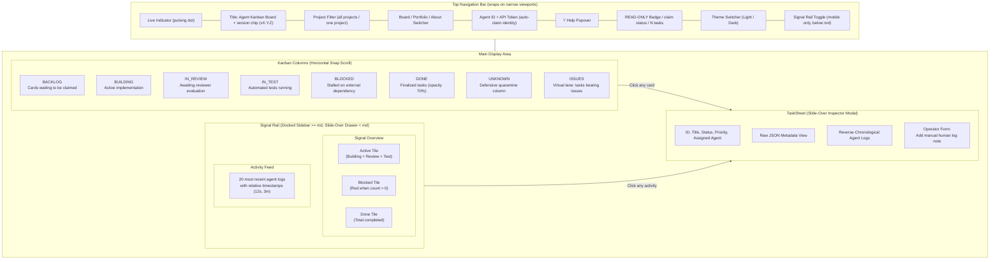
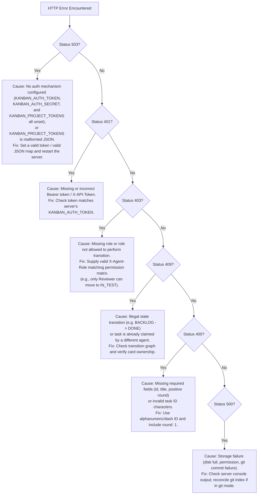

# Agent Kanban Board — User & Operator Manual

**Audience:** AI Swarm Architects, Autonomous Loop Runners, DevOps Engineers, and Human Operators  
**System:** Agent Kanban Board v2.3.13

---

## 1. System Overview & End-to-End Agent Lifecycle

The **Agent Kanban Board** provides an immutable, real-time state machine and monitoring dashboard for swarms of autonomous coding agents. Unlike human-facing project trackers, it enforces strict programmatic guardrails, claim contention locking, and role-based permissions to guarantee reliable automated execution without human interference.

### Autonomous Swarm Execution Flowchart



---

## 2. Quickstart & Installation

### 2.1 System Prerequisites
- **Node.js:** v20.x or v22.x LTS
- **npm:** v9.x or higher
- **Git:** v2.30+ (required if using Git-backed YAML storage)
- **Web Browser:** Modern evergreen browser with native ES Module and Server-Sent Events support (Chrome, Firefox, Safari, Edge).

### 2.2 Setup Commands

```bash
# Clone the repository
git clone <repo-url> agent-kanban-board
cd agent-kanban-board

# Install server and client dependencies
cd server && npm install && cd ..
cd client && npm install && cd ..
```

---

## 3. Configuration & Environment Variables

The server and client are configured via environment variables.

### 3.1 Server Environment Variables

| Variable | Default Value | Description |
|---|---|---|
| `PORT` | `4000` | HTTP port on which Express listens. |
| `HOST` | `127.0.0.1` (local) / `0.0.0.0` (when `PORT` injected) | Network interface to bind. |
| `KANBAN_AUTH_TOKEN` | *(None)* | **Mandatory for mutations** unless another mechanism is set. Shared secret for all `POST`, `PATCH`, `PUT`, `DELETE`. Unset → mutations return `503`. |
| `KANBAN_ADMIN_TOKEN` | *(None)* | Superuser token spanning every project. Audited as `admin_write`. |
| `KANBAN_PROJECT_TOKENS` | *(None)* | JSON map `{"project":"token"}` enabling per-project isolation. |
| `KANBAN_AUTH_SECRET` | *(None)* | Enables HMAC session tokens via `POST /api/auth/session` (stateless, 24h). |
| `KANBAN_AUTH_LOG` | `off` | Set truthy (not `0`/`false`) to emit redacted auth-failure logs. |
| `KANBAN_STORAGE_BACKEND` | `json` | Storage engine: `json` (file) or `git` (YAML card per task). |
| `KANBAN_DATA_FILE` | `server/tasks.json` | Default-project JSON file. |
| `KANBAN_DATA_DIR` | *(None)* | Root for named projects (`tasks/<project>.json`) + archives. |
| `KANBAN_DEFAULT_PROJECT` | `default` | Implicit single-project name. |
| `KANBAN_ARCHIVE_AFTER_DAYS` | `30` | Age after which `DONE` tasks archive (`0` disables). |
| `KANBAN_GIT_DIR` | *(See ADR-001)* | Directory containing `.yml` cards when using `git` backend. |
| `KANBAN_GIT_COMMIT` | `true` | Set `false` to disable auto-commits in git mode. |
| `KANBAN_ALLOWED_ORIGIN` | `http://localhost:5173` | Comma-separated CORS origins. Wildcard `*` is prohibited. |
| `KANBAN_CLAIM_TTL_MS` | `600000` | Lease TTL (10 min); expired leases are auto-reclaimed. |
| `KANBAN_ORPHAN_GRACE_MS` | `300000` | Grace before an ownerless ACTIVE task is normalized to BACKLOG. Decoupled from the claim TTL. Anchored on `updated`; any later write resets it. `0` reaps immediately. |
| `KANBAN_REAP_ENABLED` / `KANBAN_REAP_INTERVAL_MS` | `true` / *(default)* | Lease reaper switch and interval. |
| `KANBAN_BACKUP_ENABLED` / `KANBAN_BACKUP_INTERVAL_MS` / `KANBAN_BACKUP_KEEP` | `off` | Opt-in periodic snapshot of task data into `backups/`, rotated to a bounded count. |
| `KANBAN_RATE_LIMIT_PER_MIN` / `KANBAN_RATE_LIMIT_WINDOW_MS` | `off` / `60000` | Per-project fixed-window rate limit on mutations. |

### 3.1.1 Telegram Reclaim Notifications

When the lease reaper returns a task to `BACKLOG` (an idle lease expired, or an ownerless active task was normalized), the server can post a full-detail alert to a Telegram group or chat. This is **off by default** and needs no extra dependency — the server calls the Telegram Bot API directly over HTTPS.

| Variable | Default | Description |
|---|---|---|
| `KANBAN_TELEGRAM_BOT_TOKEN` | *(unset)* | Bot token from **@BotFather**. Required to enable alerts. |
| `KANBAN_TELEGRAM_CHAT_ID` | *(unset)* | Target chat/group id. A group id is negative (e.g. `-5349084979`). |
| `KANBAN_NOTIFY_EVENTS` | `lease_expired,orphan_normalized` | Comma-separated reclaim reasons that alert: `lease_expired`, `orphan_normalized`. |
| `KANBAN_NOTIFY_PROJECTS` | *(all)* | Optional comma-separated project allow-list. |
| `KANBAN_NOTIFY_INCLUDE_DESC` | `true` | Include a truncated (300-char) task description. `false` omits it. |
| `KANBAN_NOTIFY_MIN_INTERVAL_MS` | `1000` | Minimum gap between alerts; the send queue is serialized so a multi-task sweep cannot trip Telegram's rate limit. |
| `KANBAN_BOARD_URL` | `https://agent-kanban.riazrahaman.com` | Base URL for the alert's deep link. |

**Setting up a bot (once):**

1. In Telegram, message **@BotFather** → `/newbot` → copy the **bot token**.
2. Add the bot to the target group (Members → Add).
3. Send the bot a command in that group: `/start@yourbotname`.
4. Read the group id:
   ```bash
   curl "https://api.telegram.org/bot<TOKEN>/getUpdates" | jq -r '.result[-1].message.chat | "\(.id) \(.type)"'
   ```
   Use the `chat.id` (negative for a group). If the result is empty, no webhook should be set (`getWebhookInfo`) and the bot may need to be re-added or a fresh command sent.
5. Set both variables on the host (e.g. Railway → Variables) and redeploy.

**Behaviour notes:**

- **One message per task.** A reclaim alerts immediately; sends are serialized with a ≥1 s gap and a `429 retry_after` is honoured, so a sweep of several tasks delivers several messages without throttling failures.
- **Failure isolation.** Delivery is fire-and-forget and wrapped: a Telegram outage is logged (`[kanban notify] send failed: …`) and **never** affects the reclaim — the task still returns to `BACKLOG`.
- **Secrets.** The bot token is server-side only, never sent to clients, never stored on the board, and redacted from logs. Treat it as a password; rotate it in BotFather if it leaks.
- **Orphan normalization** (an *ownerless active* task) is only reaped once a grace window has elapsed (`KANBAN_ORPHAN_GRACE_MS`, decoupled, default 5 min), then it alerts; a **lease expiry** alerts at TTL + one sweep (default ≈10–10.5 min). The message's `Reason` line distinguishes them. The grace window exists because entering an active stage with a status-only `PATCH` is a legitimate intermediate state, not a stuck card.

### 3.2 Client Environment Variables

| Variable | Default Value | Description |
|---|---|---|
| `VITE_API_BASE` | `/api` | Base URL of the API server (same-origin by default; set an absolute URL to split origin). |
| `VITE_PORT` | `5173` | Local Vite dev server port. |

---

## 4. Launching the System

### 4.1 Running in Development Mode

#### Terminal 1: Backend API Server
```bash
# Set authentication token and launch API
export KANBAN_AUTH_TOKEN="my-agent-swarm-secret"
npm start
```
*The API is now running on `http://localhost:4000`.*

#### Terminal 2: Frontend Dashboard
```bash
cd client
npm run dev
```
*Open `http://localhost:5173` in your browser.*

### 4.2 Building & Running for Production
```bash
# Run tests and security checks
make test
make sec

# Compile client production bundle
make build

# Launch the server
npm start
```

### 4.3 Cloud Deployment (Render / Railway)

The server is a stateful long-running Node process (it holds an in-memory cache, runs a background lease reaper, and keeps SSE connections open), so it must run on a platform that supports a persistent process — not a serverless/FaaS host. The repo ships two blueprint files:

- `render.yaml` — Render.com web service (Node runtime, disk-backed).
- `railway.json` — Railway (Railpack builder, healthcheck, start command).

Both rely on the server's own `startCommand` / `npm start` and the fact that it binds `0.0.0.0` whenever `PORT` is injected. Because the in-memory store is backed by files, attach a **persistent volume/disk** and point the storage env vars at it, or all data is lost on redeploy:

| Variable | Value | Why |
|---|---|---|
| `KANBAN_STORAGE_BACKEND` | `json` | File backend (default). |
| `KANBAN_DATA_FILE` | `/data/tasks.json` | **Default project** location — its built-in default is the ephemeral `server/tasks.json`. |
| `KANBAN_DATA_DIR` | `/data` | Named projects (`tasks/<project>.json`) and archives. |
| `KANBAN_AUTH_TOKEN` | *(secret)* | Required — mutations fail closed with `503` when unset. |
| `KANBAN_PROJECT_TOKENS` | *(JSON map)* | Optional per-project scoping, e.g. `{"myapp":"tok"}`. |
| `KANBAN_ALLOWED_ORIGIN` | *(public URL)* | Comma-separated CORS allow-list. |
| `HOST` | `0.0.0.0` | Bind all interfaces (auto when `PORT` is set). |

Generate secrets with `openssl rand -hex 32`. Health probes can target `GET /api/health` (or `/healthz`), which reports store-load state and reaper status.

---

## 5. Web Dashboard User Guide

The dashboard is designed for high-density, real-time operational oversight.



### 5.1 Board Layout & Columns
- **Backlog:** Tasks defined and ready for agent assignment.
- **Building:** Active implementation by a builder agent.
- **In Review:** Implementation complete; awaiting code review sign-off.
- **In Test:** Review approved; automated test suite or verification active.
- **Blocked:** Task blocked by external dependencies or human intervention requirement.
- **Done:** Fully finalized and verified tasks (terminal state).
- **Unknown:** Defensive quarantine lane for cards with unmapped or malformed statuses, isolating corrupt state without unmounting the board.
- **Issues (Swimlane):** Dedicated column aggregating any card with registered issues.

> [!TIP]
> The board scrolls horizontally. When more columns exist than fit the viewport, an edge-fade gradient and a paging chevron appear on the side that has hidden columns — click the chevron (or scroll/swipe) to page one column at a time. On the **all projects** view each card also shows its owning **project chip** so cards from different projects are distinguishable; switch the header's project filter to a single project to hide the chips and scope the board.

### 5.2 Card Anatomy
- **Left 3px Color Stripe:** Visual severity and state indicator:
  - Green (`border-l-pass`): `DONE`
  - Blue (`border-l-live`): `BUILDING` / `IN_TEST`
  - Yellow (`border-l-warn`): `IN_REVIEW`
  - Grey (`border-l-block`): `BLOCKED`
  - Hairline (`border-l-line`): `BACKLOG` / `UNKNOWN`
- **Task ID:** Monospace identifier (e.g. `chess-c1`).
- **Status Badge:** Normalized status with glyph markers (`▲` for review, `•` for active execution).
- **Project Chip:** Shown on the unscoped **all projects** board so cards from different projects are distinguishable (hidden when a single project is selected).
- **Assigned Agent:** Indicates which autonomous agent holds the card claim.
- **Issues Pill:** Displayed when active issues exist on the card.

### 5.3 Task Inspector Sheet (Slide-Over Drawer)
Clicking any card opens the Inspector Sheet:
- View complete title, priority, status badge, and assigned agent.
- Read comprehensive task descriptions and structured JSON metadata.
- **Agent Log:** Reverse-chronological timeline of operational logs submitted by agents.
- **Stage ownership:** The `stage_owners` history shows which actor created, claimed, or transitioned each lifecycle stage.
- **Operator Notes (Human Form):** Human operators can enter manual notes directly into the card timeline.

Privileged operators can remove one task with `DELETE /api/tasks/:id` or bulk-clean selected/filtered tasks with `POST /api/tasks/purge`. Both operations require a privileged role and are audited; they are not available to ordinary lifecycle roles.

> [!NOTE]
> The frontend dashboard is primarily an observability viewport. When `KANBAN_AUTH_TOKEN` is configured on the backend, mutating API calls directly from the browser (such as the TaskSheet manual log form) require authorization credentials. Operators should append manual logs using authenticated cURL/HTTP requests with `-H "X-Agent-Role: human"` and the bearer token.

### 5.4 Signal Overview & Live Activity Feed
- Located on the right-hand sidebar.
- **Signal Overview:** Real-time counters for `Active` (`BUILDING` + `IN_REVIEW` + `IN_TEST`), `Blocked` (turns red when $>0$), and total `Done`.
- **Activity Feed:** Live streaming log of the 20 most recent agent actions across all tasks with relative timestamps (`12s`, `4m`).

### 5.5 Theme Customization
Click the **Light / Dark** button in the header to switch color themes. Your explicit choice always wins over the operating system preference and is persisted in browser `localStorage`; with no stored choice the dashboard follows the OS `prefers-color-scheme`. Native form controls (including the project filter's option popup) follow the active theme via `color-scheme`.

The light theme uses a warm cream palette; the dark theme uses a warm charcoal palette (not pure black, so the two themes read as one product). Both meet WCAG AA contrast for body text.

### 5.6 Responsive & Mobile Layout
The dashboard is responsive from ~360px phone widths up to widescreen desktop:

- **App shell:** The header wraps onto multiple rows instead of forcing a single wide row, so the page never scrolls horizontally.
- **Board columns:** Below the `md` breakpoint each column is `85vw` wide with horizontal snap scrolling (one column per swipe); from `md` up columns are a fixed 288px (`w-72`).
- **Signal Rail:** Docked as a right-hand sidebar at `md` and above; below `md` it collapses into a slide-over **drawer** opened by the header's signal-rail toggle button (with a dimmed backdrop, closable by tapping the backdrop).
- **Touch targets:** Interactive header controls are enlarged on small screens.
- **Viewport height:** Uses `100dvh` where supported so the layout is not clipped by mobile browser URL bars.
- Lower-priority header chips (`read-only`, claim status, task count) progressively hide on narrow viewports; the project filter and token input remain available.

A regression guard (`client/src/lib/responsive.test.mjs`) locks these invariants in CI.

### 5.7 About View
The header's segmented switcher (**Board / Portfolio / About**) opens a third top-level view: an in-app product overview aimed at new adopters and contributors.

- **Hero:** the product pitch ("A trusted state register for swarms of coding agents"), a short lead, and two calls to action (open the live demo / fork on GitHub).
- **Headless-first snippet:** a `curl` walkthrough showing an agent claiming the next task and advancing it, to make the API-first model concrete.
- **Trust strip:** key credibility metrics (server/client test counts, the Node 20 & 22 CI matrix, the count of architecture decision records).
- **"Why a normal board isn't enough":** three cards pairing each failure mode with the exact mechanism that handles it (`withMutationLock`, the lease plus reaper, the transition graph + role matrix).
- **Lifecycle walk:** the five-state lifecycle (`BACKLOG → BUILDING → IN_REVIEW → IN_TEST → DONE`, plus `BLOCKED`) with the role that acts at each step.
- **Capabilities table:** each capability mapped to the source file that implements it.
- **Architecture & code flow:** an additive section that goes deeper than the capability list — a **stack table** (layer → choice → why → location), a step-by-step walk of the **next-claim code path** (route → auth → mutation lock → eligibility → `applyClaim` → persist-before-memory → SSE notify), the **three safety layers** that guard every write (optimistic concurrency, the transition graph + role matrix, lease ownership), a walk of the **reclaim-alert path** (stalled heartbeat → `reapExpiredClaims` → `reclaimTaskInner` → `notify()` → `notifier.js` → Telegram, including the fail-silent delivery guarantee), and a six-layer summary mirroring the system-design chapter. It is mobile-first: the stack table collapses into labelled cards on narrow screens.
- **Guided tour:** curated screenshots served from `/landing/*.png` (board, project filter, task inspector, portfolio, dark mode).
- **FAQ and community CTA:** hosting, telemetry, database, and how to connect a project.

The view takes the live server `version` as a prop, so the version shown there can never go stale. It inherits the active theme (including the warm-charcoal dark palette) and the responsive layout automatically.

---

## 6. Autonomous Swarm Integration Guide

Autonomous agents interact with the board exclusively through HTTP requests.

### 6.1 Authentication & Role Headers
Every mutating request must include:
1. **Token:** `Authorization: Bearer <token>` or `X-API-Token: <token>`. Sources: `KANBAN_AUTH_TOKEN` (global), `KANBAN_ADMIN_TOKEN` (spans all), `KANBAN_PROJECT_TOKENS` (per-project map), or an HMAC session token issued via `POST /api/auth/session` (when `KANBAN_AUTH_SECRET` is set).
2. **Role:** `X-Agent-Role: <role>` (Allowed: `builder`, `reviewer`, `tester`, `runner`, `system`, `human`, `admin`)
3. **Agent ID (Optional but recommended):** `X-Agent-Id: <agent-name>`

> To connect a brand-new project, see [ONBOARDING.md](../../ONBOARDING.md).

---

### 6.2 Agent Lifecycle Example (cURL)

#### Step 1: Create a Task (Runner/Orchestrator)
```bash
curl -X POST http://localhost:4000/api/tasks \
  -H "Authorization: Bearer $KANBAN_AUTH_TOKEN" \
  -H "X-Agent-Role: runner" \
  -H "Content-Type: application/json" \
  -d '{
    "id": "task-auth-01",
    "title": "Implement JWT validation middleware",
    "description": "Add token validation with expiry checks",
    "status": "BACKLOG",
    "priority": "high",
    "round": 1
  }'
```

#### Step 2: Claim the Task (Builder Agent)
```bash
curl -X POST http://localhost:4000/api/tasks/task-auth-01/claim \
  -H "Authorization: Bearer $KANBAN_AUTH_TOKEN" \
  -H "X-Agent-Role: builder" \
  -H "Content-Type: application/json" \
  -d '{ "agent_id": "builder-codex" }'
```
*Note: Successful claim automatically moves the card from `BACKLOG` to `BUILDING`.*

#### Step 3: Append Progress Logs (Builder Agent)
```bash
curl -X POST http://localhost:4000/api/tasks/task-auth-01/logs \
  -H "Authorization: Bearer $KANBAN_AUTH_TOKEN" \
  -H "X-Agent-Role: builder" \
  -H "Content-Type: application/json" \
  -d '{
    "agent_id": "builder-codex",
    "message": "Scaffolded auth middleware; writing unit tests."
  }'
```

#### Step 4: Submit for Review (Builder Agent)
```bash
curl -X PATCH http://localhost:4000/api/tasks/task-auth-01 \
  -H "Authorization: Bearer $KANBAN_AUTH_TOKEN" \
  -H "X-Agent-Role: builder" \
  -H "Content-Type: application/json" \
  -d '{ "status": "IN_REVIEW" }'
```

#### Step 5: Approve & Advance to Test (Reviewer Agent)
```bash
curl -X PATCH http://localhost:4000/api/tasks/task-auth-01 \
  -H "Authorization: Bearer $KANBAN_AUTH_TOKEN" \
  -H "X-Agent-Role: reviewer" \
  -H "Content-Type: application/json" \
  -d '{ "status": "IN_TEST" }'
```

#### Step 6: Verify & Finalize (Tester Agent)
```bash
curl -X PATCH http://localhost:4000/api/tasks/task-auth-01 \
  -H "Authorization: Bearer $KANBAN_AUTH_TOKEN" \
  -H "X-Agent-Role: tester" \
  -H "Content-Type: application/json" \
  -d '{ "status": "DONE" }'
```

---

### 6.3 Python Swarm Client Example

```python
import os
import requests

API_URL = "http://localhost:4000/api"
TOKEN = os.getenv("KANBAN_AUTH_TOKEN", "default-secret")

def agent_claim_and_build(task_id: str, agent_id: str):
    headers = {
        "Authorization": f"Bearer {TOKEN}",
        "X-Agent-Role": "builder",
        "X-Agent-Id": agent_id,
        "Content-Type": "application/json"
    }
    
    # 1. Claim task
    res = requests.post(f"{API_URL}/tasks/{task_id}/claim", json={"agent_id": agent_id}, headers=headers)
    if res.status_code == 409:
        print(f"Task {task_id} already claimed by another agent!")
        return False
    res.raise_for_status()
    print(f"Successfully claimed {task_id}")

    # 2. Append operational log
    requests.post(
        f"{API_URL}/tasks/{task_id}/logs",
        json={"agent_id": agent_id, "message": "Starting code generation..."},
        headers=headers
    ).raise_for_status()

    # 3. Move to review
    requests.patch(
        f"{API_URL}/tasks/{task_id}",
        json={"status": "IN_REVIEW"},
        headers=headers
    ).raise_for_status()
    print(f"Task {task_id} submitted for review")
    return True
```

---

## 7. Troubleshooting & Error Resolution Guide

### Diagnostic Decision Tree



### Error Code Reference Catalog

| Status Code | Meaning | Common Cause & Resolution |
|---|---|---|
| **`400 Bad Request`** | Validation Error | - Missing `id` or `title` during creation.<br>- `id` contains invalid characters (must match `^[A-Za-z0-9_-]+$`).<br>- Missing or non-positive integer `round`.<br>- Malformed status value. |
| **`401 Unauthorized`** | Authentication Failure | - Missing or mismatched `Authorization: Bearer <token>` or `X-API-Token: <token>`. Check `KANBAN_AUTH_TOKEN`. |
| **`403 Forbidden`** | Role Access Denied | - Missing `X-Agent-Role` or `role` body property.<br>- Role not permitted to make transition (e.g. `builder` trying to mark `DONE`). |
| **`404 Not Found`** | Resource Missing | - Task ID does not exist in store. Verify task ID via `GET /api/tasks`. |
| **`409 Conflict`** | State Machine or Claim Contention | - Attempting an illegal state transition (e.g. `BACKLOG` $\to$ `DONE`).<br>- Attempting to transition out of terminal state `DONE`.<br>- Attempting to claim a task already held by another agent. |
| **`500 Internal Error`** | Server / Git Error | - Git persistence failure (e.g. git hook rejection, index lock). Check server terminal logs. |
| **`503 Unavailable`** | Server Unconfigured | - No auth mechanism is configured (`KANBAN_AUTH_TOKEN`, `KANBAN_AUTH_SECRET`, and `KANBAN_PROJECT_TOKENS` all unset), **or** `KANBAN_PROJECT_TOKENS` is not valid JSON. Mutations are fail-closed until a valid token is configured. |

---

## 8. Backup, Storage & Maintenance Operations

### 8.1 Standalone JSON Mode
- All data resides in `server/tasks.json` (default project) or `KANBAN_DATA_DIR/tasks/<project>.json` (named projects).
- **Automatic backup (recommended):** set `KANBAN_BACKUP_ENABLED=1` (with `KANBAN_BACKUP_INTERVAL_MS` and `KANBAN_BACKUP_KEEP`) to snapshot task data into a `backups/` directory, rotated to a bounded count.
- **Manual backup:** copy the JSON file(s):
  ```bash
  cp server/tasks.json server/tasks.backup.$(date +%Y%m%d_%H%M%S).json
  ```
- **Reset / Truncate:** To reset all tasks, stop the server, write `{ "tasks": [] }` to `server/tasks.json`, and restart.

### 8.2 Git-Backed YAML Mode
- Tasks are stored in individual `<id>.yml` files.
- Each state transition creates a Git commit.
- **Recovery from Failed Commit (ADR-002):**
  If a crash occurs after the file rename but before `git commit`, inspect `git status` in the cards directory and either commit or discard the uncommitted card:
  ```bash
  cd $KANBAN_GIT_DIR
  git status
  git add . && git commit -m "ops(recovery): reconcile uncommitted card state"
  ```
