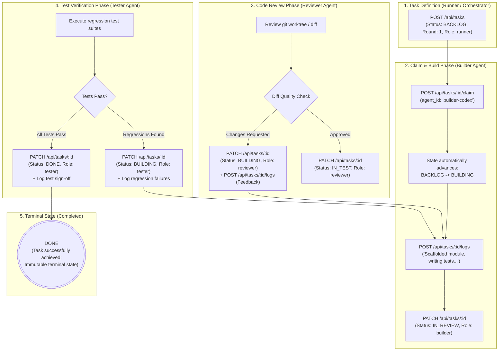
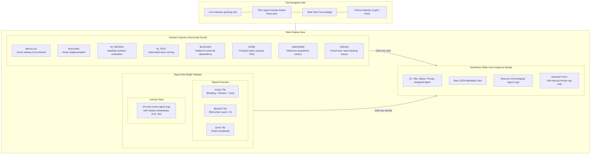
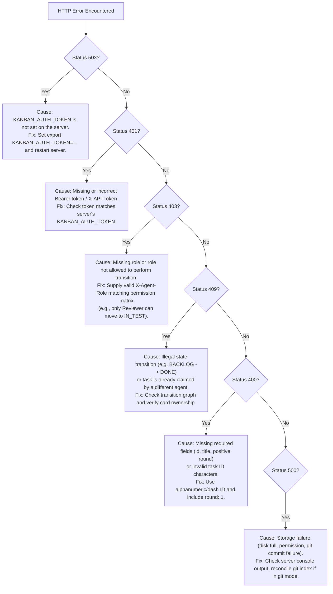

# Agent Kanban Board — User & Operator Manual

**Audience:** AI Swarm Architects, Autonomous Loop Runners, DevOps Engineers, and Human Operators  
**System:** Agent Kanban Board v1.0.0

---

## 1. System Overview & End-to-End Agent Lifecycle

The **Agent Kanban Board** provides an immutable, real-time state machine and monitoring dashboard for swarms of autonomous coding agents. Unlike human-facing project trackers, it enforces strict programmatic guardrails, claim contention locking, and role-based permissions to guarantee reliable automated execution without human interference.

### Autonomous Swarm Execution Flowchart



---

## 2. Quickstart & Installation

### 2.1 System Prerequisites
- **Node.js:** v20.x or v22.x LTS
- **npm:** v9.x or higher
- **Git:** v2.30+ (required if using Git-backed YAML storage)
- **Web Browser:** Modern evergreen browser with native ES Module and Server-Sent Events support (Chrome, Firefox, Safari, Edge).

### 2.2 Setup Commands

```bash
# Clone the repository
git clone <repo-url> agent-kanban-board
cd agent-kanban-board

# Install server and client dependencies
cd server && npm install && cd ..
cd client && npm install && cd ..
```

---

## 3. Configuration & Environment Variables

The server and client are configured via environment variables.

### 3.1 Server Environment Variables

| Variable | Default Value | Description |
|---|---|---|
| `PORT` | `4000` | HTTP port on which Express listens. |
| `HOST` | `127.0.0.1` | Network interface to bind (use `127.0.0.1` for local-first lockdown). |
| `KANBAN_AUTH_TOKEN` | *(None)* | **Mandatory for mutations.** Shared secret token required for all `POST`, `PATCH`, `PUT`, and `DELETE` calls. If not set, mutating APIs return `503 Service Unavailable`. |
| `KANBAN_STORAGE_BACKEND` | `json` | Storage engine: `json` (single file) or `git` (YAML card per task). |
| `KANBAN_DATA_FILE` | `server/tasks.json` | Path to JSON file when using `json` storage backend. |
| `KANBAN_GIT_DIR` | *(See ADR-001)* | Directory containing `.yml` cards when using `git` storage backend. |
| `KANBAN_GIT_COMMIT` | `true` | When `git` storage is used, set `false` to disable auto-commits on card mutation. |
| `KANBAN_ALLOWED_ORIGIN` | `http://localhost:5173` | Explicit CORS origin allowed to communicate with the API. Wildcard `*` is prohibited. |

### 3.2 Client Environment Variables

| Variable | Default Value | Description |
|---|---|---|
| `VITE_API_BASE` | `http://localhost:4000/api` | Base URL of the API server. |
| `VITE_PORT` | `5173` | Local Vite dev server port. |

---

## 4. Launching the System

### 4.1 Running in Development Mode

#### Terminal 1: Backend API Server
```bash
# Set authentication token and launch API
export KANBAN_AUTH_TOKEN="my-agent-swarm-secret"
npm start
```
*The API is now running on `http://localhost:4000`.*

#### Terminal 2: Frontend Dashboard
```bash
cd client
npm run dev
```
*Open `http://localhost:5173` in your browser.*

### 4.2 Building & Running for Production
```bash
# Run tests and security checks
make test
make sec

# Compile client production bundle
make build

# Launch the server
npm start
```

---

## 5. Web Dashboard User Guide

The dashboard is designed for high-density, real-time operational oversight.



### 5.1 Board Layout & Columns
- **Backlog:** Tasks defined and ready for agent assignment.
- **Building:** Active implementation by a builder agent.
- **In Review:** Implementation complete; awaiting code review sign-off.
- **In Test:** Review approved; automated test suite or verification active.
- **Blocked:** Task blocked by external dependencies or human intervention requirement.
- **Done:** Fully finalized and verified tasks (terminal state).
- **Unknown:** Defensive quarantine lane for cards with unmapped or malformed statuses, isolating corrupt state without unmounting the board.
- **Issues (Swimlane):** Dedicated column aggregating any card with registered issues.

### 5.2 Card Anatomy
- **Left 3px Color Stripe:** Visual severity and state indicator:
  - Green (`border-l-pass`): `DONE`
  - Blue (`border-l-live`): `BUILDING` / `IN_TEST`
  - Yellow (`border-l-warn`): `IN_REVIEW`
  - Grey (`border-l-block`): `BLOCKED`
  - Hairline (`border-l-line`): `BACKLOG` / `UNKNOWN`
- **Task ID:** Monospace identifier (e.g. `chess-c1`).
- **Status Badge:** Normalized status with glyph markers (`▲` for review, `•` for active execution).
- **Assigned Agent:** Indicates which autonomous agent holds the card claim.
- **Issues Pill:** Displayed when active issues exist on the card.

### 5.3 Task Inspector Sheet (Slide-Over Drawer)
Clicking any card opens the Inspector Sheet:
- View complete title, priority, status badge, and assigned agent.
- Read comprehensive task descriptions and structured JSON metadata.
- **Agent Log:** Reverse-chronological timeline of operational logs submitted by agents.
- **Operator Notes (Human Form):** Human operators can enter manual notes directly into the card timeline.

> [!NOTE]
> The frontend dashboard is primarily an observability viewport. When `KANBAN_AUTH_TOKEN` is configured on the backend, mutating API calls directly from the browser (such as the TaskSheet manual log form) require authorization credentials. Operators should append manual logs using authenticated cURL/HTTP requests with `-H "X-Agent-Role: human"` and the bearer token.

### 5.4 Signal Overview & Live Activity Feed
- Located on the right-hand sidebar.
- **Signal Overview:** Real-time counters for `Active` (`BUILDING` + `IN_REVIEW` + `IN_TEST`), `Blocked` (turns red when $>0$), and total `Done`.
- **Activity Feed:** Live streaming log of the 20 most recent agent actions across all tasks with relative timestamps (`12s`, `4m`).

### 5.5 Theme Customization
Click the **Light / Dark** button in the header to switch color themes. Your preference is persisted in browser `localStorage`.

---

## 6. Autonomous Swarm Integration Guide

Autonomous agents interact with the board exclusively through HTTP requests.

### 6.1 Authentication & Role Headers
Every mutating request must include:
1. **Token:** `Authorization: Bearer <KANBAN_AUTH_TOKEN>` or `X-API-Token: <KANBAN_AUTH_TOKEN>`
2. **Role:** `X-Agent-Role: <role>` (Allowed: `builder`, `reviewer`, `tester`, `runner`, `system`, `human`, `admin`)
3. **Agent ID (Optional but recommended):** `X-Agent-Id: <agent-name>`

---

### 6.2 Agent Lifecycle Example (cURL)

#### Step 1: Create a Task (Runner/Orchestrator)
```bash
curl -X POST http://localhost:4000/api/tasks \
  -H "Authorization: Bearer $KANBAN_AUTH_TOKEN" \
  -H "X-Agent-Role: runner" \
  -H "Content-Type: application/json" \
  -d '{
    "id": "task-auth-01",
    "title": "Implement JWT validation middleware",
    "description": "Add token validation with expiry checks",
    "status": "BACKLOG",
    "priority": "high",
    "round": 1
  }'
```

#### Step 2: Claim the Task (Builder Agent)
```bash
curl -X POST http://localhost:4000/api/tasks/task-auth-01/claim \
  -H "Authorization: Bearer $KANBAN_AUTH_TOKEN" \
  -H "X-Agent-Role: builder" \
  -H "Content-Type: application/json" \
  -d '{ "agent_id": "builder-codex" }'
```
*Note: Successful claim automatically moves the card from `BACKLOG` to `BUILDING`.*

#### Step 3: Append Progress Logs (Builder Agent)
```bash
curl -X POST http://localhost:4000/api/tasks/task-auth-01/logs \
  -H "Authorization: Bearer $KANBAN_AUTH_TOKEN" \
  -H "X-Agent-Role: builder" \
  -H "Content-Type: application/json" \
  -d '{
    "agent_id": "builder-codex",
    "message": "Scaffolded auth middleware; writing unit tests."
  }'
```

#### Step 4: Submit for Review (Builder Agent)
```bash
curl -X PATCH http://localhost:4000/api/tasks/task-auth-01 \
  -H "Authorization: Bearer $KANBAN_AUTH_TOKEN" \
  -H "X-Agent-Role: builder" \
  -H "Content-Type: application/json" \
  -d '{ "status": "IN_REVIEW" }'
```

#### Step 5: Approve & Advance to Test (Reviewer Agent)
```bash
curl -X PATCH http://localhost:4000/api/tasks/task-auth-01 \
  -H "Authorization: Bearer $KANBAN_AUTH_TOKEN" \
  -H "X-Agent-Role: reviewer" \
  -H "Content-Type: application/json" \
  -d '{ "status": "IN_TEST" }'
```

#### Step 6: Verify & Finalize (Tester Agent)
```bash
curl -X PATCH http://localhost:4000/api/tasks/task-auth-01 \
  -H "Authorization: Bearer $KANBAN_AUTH_TOKEN" \
  -H "X-Agent-Role: tester" \
  -H "Content-Type: application/json" \
  -d '{ "status": "DONE" }'
```

---

### 6.3 Python Swarm Client Example

```python
import os
import requests

API_URL = "http://localhost:4000/api"
TOKEN = os.getenv("KANBAN_AUTH_TOKEN", "default-secret")

def agent_claim_and_build(task_id: str, agent_id: str):
    headers = {
        "Authorization": f"Bearer {TOKEN}",
        "X-Agent-Role": "builder",
        "X-Agent-Id": agent_id,
        "Content-Type": "application/json"
    }
    
    # 1. Claim task
    res = requests.post(f"{API_URL}/tasks/{task_id}/claim", json={"agent_id": agent_id}, headers=headers)
    if res.status_code == 409:
        print(f"Task {task_id} already claimed by another agent!")
        return False
    res.raise_for_status()
    print(f"Successfully claimed {task_id}")

    # 2. Append operational log
    requests.post(
        f"{API_URL}/tasks/{task_id}/logs",
        json={"agent_id": agent_id, "message": "Starting code generation..."},
        headers=headers
    ).raise_for_status()

    # 3. Move to review
    requests.patch(
        f"{API_URL}/tasks/{task_id}",
        json={"status": "IN_REVIEW"},
        headers=headers
    ).raise_for_status()
    print(f"Task {task_id} submitted for review")
    return True
```

---

## 7. Troubleshooting & Error Resolution Guide

### Diagnostic Decision Tree



### Error Code Reference Catalog

| Status Code | Meaning | Common Cause & Resolution |
|---|---|---|
| **`400 Bad Request`** | Validation Error | - Missing `id` or `title` during creation.<br>- `id` contains invalid characters (must match `^[A-Za-z0-9_-]+$`).<br>- Missing or non-positive integer `round`.<br>- Malformed status value. |
| **`401 Unauthorized`** | Authentication Failure | - Missing or mismatched `Authorization: Bearer <token>` or `X-API-Token: <token>`. Check `KANBAN_AUTH_TOKEN`. |
| **`403 Forbidden`** | Role Access Denied | - Missing `X-Agent-Role` or `role` body property.<br>- Role not permitted to make transition (e.g. `builder` trying to mark `DONE`). |
| **`404 Not Found`** | Resource Missing | - Task ID does not exist in store. Verify task ID via `GET /api/tasks`. |
| **`409 Conflict`** | State Machine or Claim Contention | - Attempting an illegal state transition (e.g. `BACKLOG` $\to$ `DONE`).<br>- Attempting to transition out of terminal state `DONE`.<br>- Attempting to claim a task already held by another agent. |
| **`500 Internal Error`** | Server / Git Error | - Git persistence failure (e.g. git hook rejection, index lock). Check server terminal logs. |
| **`503 Unavailable`** | Server Unconfigured | - `KANBAN_AUTH_TOKEN` is not configured on the server. Mutations are blocked until configured. |

---

## 8. Backup, Storage & Maintenance Operations

### 8.1 Standalone JSON Mode
- All data resides in `server/tasks.json` (or `KANBAN_DATA_FILE`).
- **Backup:** Simply copy the JSON file:
  ```bash
  cp server/tasks.json server/tasks.backup.$(date +%Y%m%d_%H%M%S).json
  ```
- **Reset / Truncate:** To reset all tasks, stop the server, write `{ "tasks": [] }` to `server/tasks.json`, and restart.

### 8.2 Git-Backed YAML Mode
- Tasks are stored in individual `<id>.yml` files.
- Each state transition creates a Git commit.
- **Recovery from Failed Commit (ADR-002):**
  If a crash occurs after the file rename but before `git commit`, inspect `git status` in the cards directory and either commit or discard the uncommitted card:
  ```bash
  cd $KANBAN_GIT_DIR
  git status
  git add . && git commit -m "ops(recovery): reconcile uncommitted card state"
  ```
