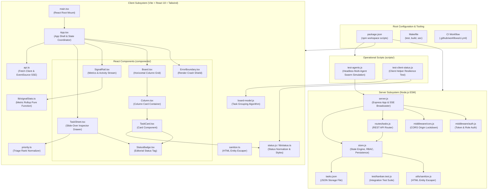
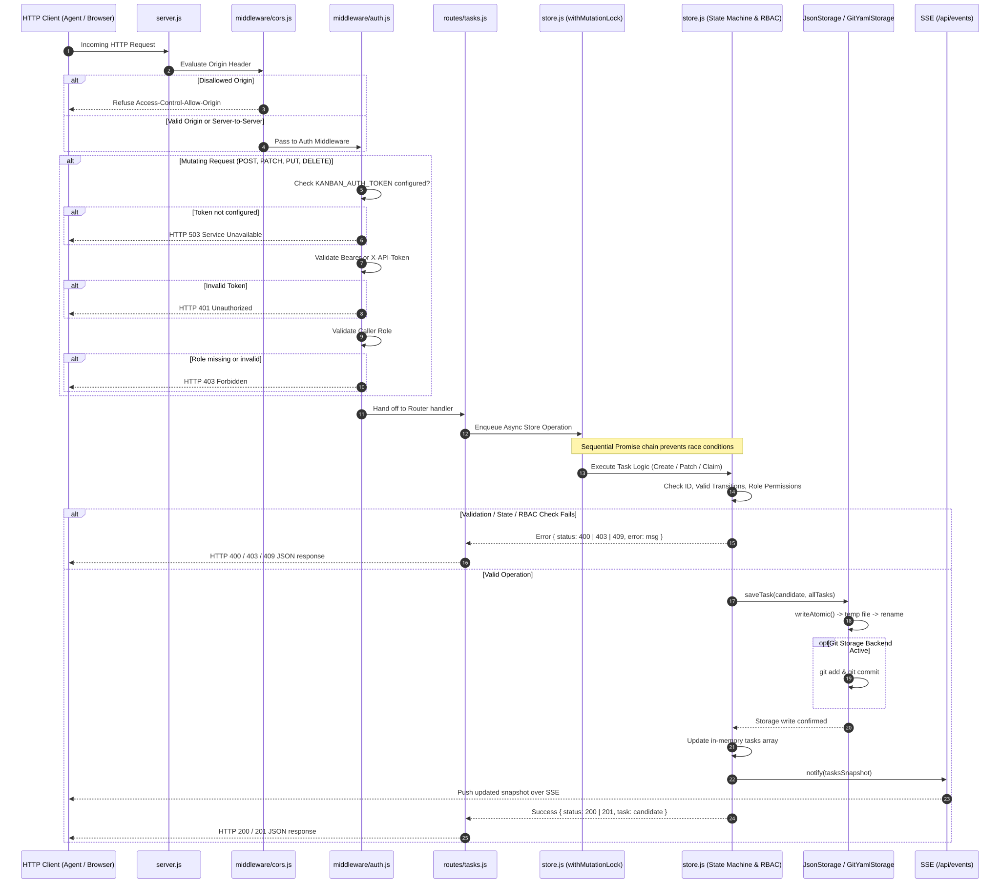
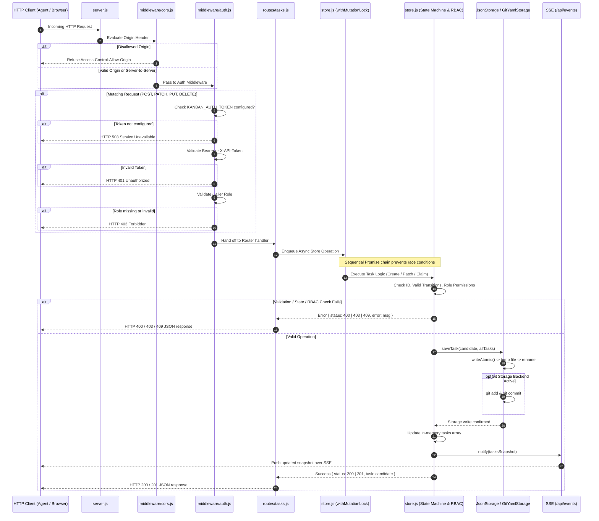
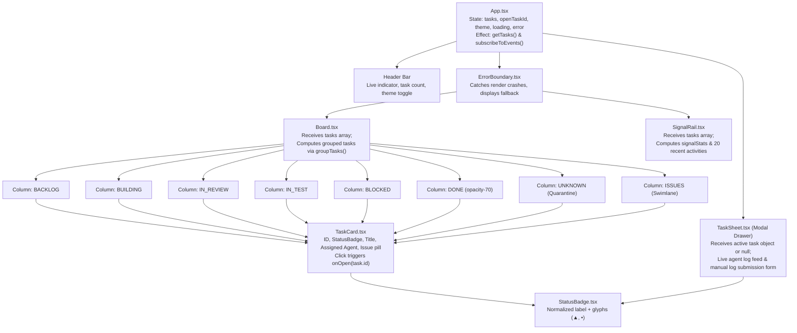

# Agent Kanban Board — File-by-File Technical Reference

This document provides a comprehensive, exhaustive walkthrough of every source, configuration, script, and documentation file across the entire `agent-kanban-board` repository.

---

## 1. Codebase Dependency & Architecture Topology

View Mermaid Source Code

---

## 2. Server Request Pipeline & Execution Flow

View Mermaid Source Code

---

## 3. Client Component Hierarchy & Data Flow

View Mermaid Source Code

---

## 4. Detailed File-by-File Technical Directory

### 4.1 Root Manifests & Orchestration

#### `package.json`
- **Path:** [`package.json`](../package.json)
- **Type:** Root npm configuration (`"type": "module"`).
- **Scripts:**
  - `npm test`: Runs server tests, client status tests, client unit tests, and compiles the client bundle.
  - `npm start`: Runs the backend API on port 4000.
  - `npm run build`: Produces production client bundle in `client/dist`.

#### `Makefile`
- **Path:** [`Makefile`](../Makefile)
- **Targets:**
  - `all`: Runs `test` and `build`.
  - `test`: Invokes `npm test`.
  - `build`: Invokes `npm run build`.
  - `start`: Launches backend server via `npm start`.
  - `sec`: Security audit target:
    1. Verifies that no personal absolute user home paths are leaked into tracked repository files.
    2. Enforces that `dangerouslySetInnerHTML` is never used inside `client/src/`.

#### `README.md`
- **Path:** [`README.md`](../README.md)
- **Content:** System description, quickstart guide, state machine transitions, storage engine modes, API table, and headless demo instructions.

#### `LICENSE`
- **Path:** [`LICENSE`](../LICENSE)
- **License:** MIT License.

#### `.gitignore`
- **Path:** [`.gitignore`](../.gitignore)
- **Entries:** Ignores `node_modules`, `dist`, build artifacts, and local environments.

---

### 4.2 Backend Server (`server/`)

#### `server/package.json`
- **Path:** [`server/package.json`](../server/package.json)
- **Dependencies:** `express` (^4.19.2), `cors` (^2.8.5), `yaml` (^2.9.0), with `qs` (^6.16.0) security override.
- **Scripts:** `"start": "node server.js"`, `"test": "node --test"`.

#### `server/server.js`
- **Path:** [`server/server.js`](../server/server.js)
- **Functions:**
  - `createApp()`: Instantiates Express, mounts CORS and Auth middlewares, mounts `/api/tasks` router, handles `/api/events` Server-Sent Events stream, and configures the global 500 error handler.
  - `startServer(port, host)`: Asynchronously loads tasks from storage into memory and binds the HTTP server.
  - CLI Auto-runner: Detects direct execution and launches server on port 4000.

#### `server/store.js`
- **Path:** [`server/store.js`](../server/store.js)
- **Core Domain State & Engine:**
  - `STATUSES`: Dictionary of loop statuses (`BACKLOG`, `BUILDING`, `IN_REVIEW`, `IN_TEST`, `BLOCKED`, `DONE`).
  - `normalizeStatus(status)`: Normalizes casing and legacy aliases (e.g., `TODO` $\to$ `BACKLOG`).
  - `canTransition(fromStatus, toStatus)`: Verifies if the proposed state jump exists in `VALID_TRANSITIONS`.
  - `canRoleTransition(role, fromStatus, toStatus)`: Enforces role permissions.
  - `writeAtomic(filePath, content)`: Creates unique temp file (`.tmp_<timestamp>_<random>`), writes content, and executes `rename` for atomic POSIX replacement.
  - `withMutationLock(operation)`: Queues mutations on a sequential Promise chain to serialize asynchronous operations.
  - `JsonStorage`: Standalone single-file JSON persistence engine.
  - `GitYamlStorage`: Git-backed YAML storage engine with path traversal protection and automated `git commit`.
  - CRUD Methods: `createTask()`, `patchTask()`, `claimTask()`, `appendLog()`, `addIssue()`.

#### `server/routes/tasks.js`
- **Path:** [`server/routes/tasks.js`](../server/routes/tasks.js)
- **Endpoints:**
  - `GET /`: Returns all tasks.
  - `POST /`: Creates a new task card (Status: 201).
  - `GET /archive`: Lists archived tasks (`?project=` scopes).
  - `POST /archive/sweep`: Runs the archive sweep now.
  - `POST /next-claim`: Claims the next available task (role from header, `?project=` scopes).
  - `GET /:id`: Retrieves single task or returns 404.
  - `PATCH /:id`: Updates status or task attributes.
  - `POST /:id/claim`: Claims task for an agent ID.
  - `POST /:id/heartbeat`: Renews a task lease.
  - `POST /:id/logs`: Appends structured operational log.
  - `GET /:id/issues`: Lists issue IDs associated with the task.
  - `POST /:id/issues`: Appends an issue ID to the task.

#### `server/routes/projects.js`, `metrics.js`, `health.js`, `auth.js`
- **Projects:** `GET /` — per-project summary counts.
- **Metrics:** `GET /` — cross-project metrics (cycle time, `by_status`, contention).
- **Health:** `GET /` (and `/healthz`) — read-only liveness/readiness probe.
- **Auth:** `POST /session` — HMAC session-token handshake (`KANBAN_AUTH_SECRET`).

#### `server/sessionAuth.js`
- **Path:** [`server/sessionAuth.js`](../server/sessionAuth.js)
- **Functions:** `authSecret()`, `createSessionToken()`, `verifySessionToken()` — stateless HMAC-SHA256 session tokens (24h expiry, role+project bound).

#### `server/middleware/auth.js`
- **Path:** [`server/middleware/auth.js`](../server/middleware/auth.js)
- **Enforcement:**
  - Permits open read-only access for `GET` requests.
  - Fails closed with 503 if no auth mechanism (`KANBAN_AUTH_TOKEN`, `KANBAN_PROJECT_TOKENS`, or `KANBAN_AUTH_SECRET`) is configured.
  - Tries HMAC session tokens first, then falls back to static tokens: per-project (`KANBAN_PROJECT_TOKENS`), admin (`KANBAN_ADMIN_TOKEN`, audited as `admin_write`), or global (`KANBAN_AUTH_TOKEN`). Returns 401 on mismatch.
  - Validates caller role against `VALID_ROLES`. Missing/unauthorized role returns 403.
  - Optional redacted auth-failure logging via `KANBAN_AUTH_LOG`.

#### `server/middleware/projectScope.js` & `rateLimit.js`
- **projectScope:** Extracts every project a request references and guards invalid `?project=` as 400.
- **rateLimit:** Per-project fixed-window rate limiting on mutations, off unless `KANBAN_RATE_LIMIT_PER_MIN` is set.

#### `server/middleware/cors.js`
- **Path:** [`server/middleware/cors.js`](../server/middleware/cors.js)
- **Enforcement:** Enforces an explicit allow-list of origins (`KANBAN_ALLOWED_ORIGIN`, comma-separated, defaults to `http://localhost:5173`). Forbids wildcard `*` and empty entries.

#### `server/utils/sanitize.js`
- **Path:** [`server/utils/sanitize.js`](../server/utils/sanitize.js)
- **Function:** `escapeHtml(str)` escapes HTML characters (`&`, `<`, `>`, `"`, `'`) to prevent Stored XSS.

#### `server/test/kanban.test.js`
- **Path:** [`server/test/kanban.test.js`](../server/test/kanban.test.js)
- **Coverage:** Complete automated test suite testing duplicate prevention, state transitions, role gating, claim contention, fail-closed auth, atomic failure rollback, git persistence, CORS lockdown, and XSS sanitization.

#### `server/tasks.json`
- **Path:** [`server/tasks.json`](../server/tasks.json)
- **Role:** Sample JSON storage file containing historical/seeded swarm tasks.

---

### 4.3 Frontend Client (`client/`)

#### `client/package.json`
- **Path:** [`client/package.json`](../client/package.json)
- **Dependencies:** `react` (^18.3.1), `react-dom` (^18.3.1).
- **Scripts:** `dev`, `build`, `preview`, `test`.

#### `client/vite.config.ts`
- **Path:** [`client/vite.config.ts`](../client/vite.config.ts)
- **Settings:** Configures Vite dev server port and React plugin.

#### `client/tailwind.config.js`
- **Path:** [`client/tailwind.config.js`](../client/tailwind.config.js)
- **Configuration:** Defines semantic color variables (`bg`, `surface`, `line`, `ink`, `muted`, `pass`, `fail`, `warn`, `block`, `live`) and editorial font stacks (`serif`, `mono`, `sans`).

#### `client/postcss.config.js`
- **Path:** [`client/postcss.config.js`](../client/postcss.config.js)
- **Settings:** Tailwind and Autoprefixer plugin registration.

#### `client/tsconfig.json`, `tsconfig.app.json`, `tsconfig.node.json`
- **Paths:** [`client/tsconfig.json`](../client/tsconfig.json), [`client/tsconfig.app.json`](../client/tsconfig.app.json), [`client/tsconfig.node.json`](../client/tsconfig.node.json)
- **Settings:** Strict TypeScript type checking rules for browser and build environments.

#### `client/index.html`
- **Path:** [`client/index.html`](../client/index.html)
- **Content:** Single-page entry HTML, Google font preloading, base dark theme class.

#### `client/src/index.css`
- **Path:** [`client/src/index.css`](../client/src/index.css)
- **Styles:** Light and dark theme CSS variable definitions meeting WCAG AA contrast standards, tabular numeric font setup, and minimal scrollbars.

#### `client/src/main.tsx`
- **Path:** [`client/src/main.tsx`](../client/src/main.tsx)
- **Execution:** Mounts `<App />` into the DOM root under `<React.StrictMode>`.

#### `client/src/App.tsx`
- **Path:** [`client/src/App.tsx`](../client/src/App.tsx)
- **Components & Hooks:** Manages `tasks`, `openTaskId`, `theme`, and `loading`. Connects to SSE events stream. Renders header bar, `<Board />`, `<SignalRail />`, `<TaskSheet />`, and `<ErrorBoundary />`.

#### `client/src/types.ts`
- **Path:** [`client/src/types.ts`](../client/src/types.ts)
- **Definitions:** Core data types (`TaskStatus`, `TaskPriority`, `AgentLog`, `Task`).

#### `client/src/api.ts`
- **Path:** [`client/src/api.ts`](../client/src/api.ts)
- **Functions:** HTTP client for REST operations (`getTasks`, `getTask`, `patchTask`, `claimTask`, `appendLog`) and `subscribeToEvents(onTasks)` for native `EventSource` SSE integration.

#### `client/src/status.js` & `status.d.ts`
- **Paths:** [`client/src/status.js`](../client/src/status.js), [`client/src/status.d.ts`](../client/src/status.d.ts)
- **Functions:** `normalizeStatus()` and `statusStyle()` resolving status strings to border stripes and badge color combinations.

#### `client/src/board-model.js` & `board-model.d.ts`
- **Paths:** [`client/src/board-model.js`](../client/src/board-model.js), [`client/src/board-model.d.ts`](../client/src/board-model.d.ts)
- **Function:** `groupTasks(tasks)` categorizing tasks into column arrays by status (`BACKLOG`, `BUILDING`, `IN_REVIEW`, `IN_TEST`, `BLOCKED`, `DONE`, `UNKNOWN`) and aggregating issues into a dedicated `ISSUES` array.

#### `client/src/priority.ts`
- **Path:** [`client/src/priority.ts`](../client/src/priority.ts)
- **Function:** `normalizePriority()` safely mapping triage ratings (`P0-critical`, etc.) to `'high' | 'medium' | 'low'`.

#### `client/src/sanitize.ts`
- **Path:** [`client/src/sanitize.ts`](../client/src/sanitize.ts)
- **Function:** Client-side HTML string escaping.

#### `client/src/lib/status.ts`
- **Path:** [`client/src/lib/status.ts`](../client/src/lib/status.ts)
- **Constants:** `CANONICAL_STATUSES` and `ACTIVE_STATUSES` matching backend definitions.

#### `client/src/lib/signalStats.ts`
- **Path:** [`client/src/lib/signalStats.ts`](../client/src/lib/signalStats.ts)
- **Function:** `computeSignalStats(tasks)` calculating active count, blocked count, and total done count.

#### `client/src/lib/signalStats.test.mjs`
- **Path:** [`client/src/lib/signalStats.test.mjs`](../client/src/lib/signalStats.test.mjs)
- **Execution:** Compiles TypeScript on-the-fly via `esbuild` and verifies statistical calculations under `node:test`.

#### Components (`client/src/components/`)
- **`Board.tsx`:** Renders horizontal column container for all 8 columns including `UNKNOWN`.
- **`Column.tsx`:** Renders column header with task count badge and vertically scrolling card container.
- **`TaskCard.tsx`:** Renders card ID, status stripe, title, agent assignment, and issues badge.
- **`StatusBadge.tsx`:** Renders status glyphs (`▲`, `•`) and styling.
- **`TaskSheet.tsx`:** Slide-over modal displaying card details, metadata, logs timeline, and human log submission form.
- **`SignalRail.tsx`:** Right sidebar rendering Signal Overview metric tiles and recent activity feed.
- **`ErrorBoundary.tsx`:** React Class Error Boundary containing card render errors.

---

### 4.4 Scripts & CI Workflows

#### `scripts/test-agents.js`
- **Path:** [`scripts/test-agents.js`](../scripts/test-agents.js)
- **Role:** Headless multi-agent workflow demo script simulating Agent-Alpha and Agent-Beta claiming, transitioning, and logging against cards via REST calls.

#### `scripts/test-client-status.js`
- **Path:** [`scripts/test-client-status.js`](../scripts/test-client-status.js)
- **Role:** Test validating client status normalizer resilience against malformed inputs.

#### `.github/workflows/ci.yml`
- **Path:** [`.github/workflows/ci.yml`](../.github/workflows/ci.yml)
- **Pipeline:** Automated CI running security checks (`make sec`), server tests, status tests, client unit tests, and production build across Node 20.x and 22.x.
